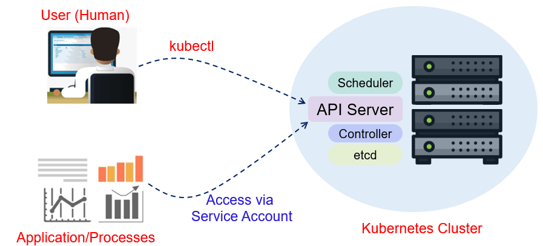

# 🈷 Service Account



Authentication kısmında, kullanıcılar olarak sertifikaları kullanarak, kubernetes API server'a authenticated olma yöntemlerini, Authorization kısmında ise, yetkilendirmeyi görmüştük. Fakat, kubernetes API server'a, sadece kullanıcıların erişmesi yeterli değil. Bir çok durumda, bizlerin pod içerisinde deploy ettiğimiz uygulamalarında Kube API server ile görüşerek, cluster üstünde işlemler yapması gerekebilir.

Kullanıcı hesapları insanlar içindir. Service Accounts podlarda çalışan processler tarafından kullanılmak üzere tasarlanmıştır. Misal, kubernetes üstünde uygulamalarınızı, deploy edecek bir uygulama yazdınız, ya da hali hazırda bu işlemleri yapan, bir yazılım kullanacaksınız. Bu uygulamayı bir pod olarak, kubernetes cluster'a deploy ettiniz.  Bu uygulamanın kubernetes API server ile görüşmesi ve ona komutlar ileterek deployment işlemlerini gerçekleştirmesi gerekiyor ve dolayısıyla bu pod içerisinde koşan uygulamanın öncelikle bir şekilde authentication adımını geçerek, kimliğinin doğrulanması sonrasında, bu işlemleri yapabilmesi adına gerekli authorization'a yani yetkiye sahip olması gerekiyor.

Bu ve benzer senaryolarda kullanılabilmesi adına, kubernetes service account isimli bir objeye sahip. 2. önceki yazıda bahsettiğimiz, sertifika tabanlı authentication insanlar içindir. Bizler bu şekilde authenticate oluyoruz. Fakat uygulamaların authenticate olması için, uygun değildir. Uygulamalar için kullanabilecek tek seçenek, service account 'dur.

Örnek service account yaml dosyası;

```yaml
apiVersion: v1
kind: ServiceAccount
metadata:
  name: testsa
  namespace: default
---
kind: Role
apiVersion: rbac.authorization.k8s.io/v1
metadata:
  name: podread
  namespace: default
rules:
- apiGroups: [""]
  resources: ["pods"]
  verbs: ["get", "watch", "list"]
---
kind: RoleBinding
apiVersion: rbac.authorization.k8s.io/v1
metadata:
  name: testsarolebinding
  namespace: default
subjects:
- kind: ServiceAccount
  name: testsa
  apiGroup: ""
roleRef:
  kind: Role
  name: podread
  apiGroup: rbac.authorization.k8s.io
---
apiVersion: v1
kind: Pod
metadata:
  name: testpod
  namespace: default
spec:
  serviceAccountName: testsa
  containers:
  - name: testcontainer
    image: alpine:latest
    ports:
    - containerPort: 80
```

Service accountlar kubernetes objesi olarak yaratabildiğimiz, tek hesap türüdür. ekranın en üstünde gördüğümüz üzere, oldukça basit bir objedir.

Bir isim ve namespace tanımlar oluştururuz. Bu örnekte gördüğümüz üzere, "testsa" isimli bir service account oluşturuyoruz. Fakat tahmin edebileceğiniz üzere, ne türde hesap oluşturursak oluşturalım, bu hesap hiçbir yetkiye sahip olmaz. Bu nedenle hemen altta gördüğünüz üzere, Öncelikle "default" namespace da pod okuma yetkilerine sahip, bir role oluşturuyoruz. Ardından da, bu rolü "testsa" isimli bir service account'a bind edecek bir rolebinding oluşturuyoruz. Bu sayede, "testsa" isimli service account 'u default namespace'de podları listeleme,izleme ve özelliklerini görme hakkına sahip oluyor.

&#x20;En alttaki örnekte, pod tanımının spec kısmında, "serviceAccountName" isimli bir parametre mevcut,  bu parametre ile, pod'a hangi service account'u atanacağını belirtiyoruz. Eğer bu anahtara aksi belirtilmezse, default isimli service account atanacak.

Kubernetes her namespace için, bir adet default isimli service account oluşturur. Ve her pod 'a aksi belirtilmezse, bu service account bağlanır. Default service account'un hiç bir yetkisi yoktur. Ama dilersek bunlara role yada, clusterRole bind ederek, gerekli yetkiyi verebiliriz.

Bir service account oluşturduğumuz zaman, bu service account için bir secret oluşturulur. Bu secret da 3 bilgi bulunur; 1. service account'un oluşturulduğu namespaces'ın adı. 2. kubernetes API server ile iletişim kurarken, HTTPS/TLS bağlantısı kurmamız gerektiğinden, bu bağlantının hata vermemesi adına gerekli sertifika bilgisi, 3. kimlik doğrulamasında kullanabileceğimiz bir Json web token(jwt) bilgisi bulunur. Bu bilgiler, service account'un bağlı olduğu pod içerisinde, /var/run/secrets/kubernetes.io/serviceaccount/ dizininde bulunur.

&#x20;Authentication kısmında kubernetes'in bir çok authentication altyapısını desteklediğinden bahsetmiştik.

Sertifika tabanlı authentication yapabildiğimiz gibi, HTTP header bilgisine sahip json web tokenları kullanarak da authenticate olabiliriz. Her service account için, bu 3 bilginin bulunduğu secret yaratılır ve bu secret /var/run/secrets/kubernetes.io/serviceaccount/  klasörüne mount edilir. Böylece podun içerisindeki uygulamaya git buradaki değerleri oku ve kullan diyebiliriz.

Pod içerisinden nasıl kubernetes API erişeceğiz?\
Her kubernetes kurulumunda, kubernetes içerisinden API server'a erişebilmek için, "kubernetes" isimli bir service yaratılır.  "kubectl get svc" dediğimiz zaman "kubernetes" adında bir servis görürüz. Her podun içerisinden bu isme gittiğimiz zaman otomatik olarak kube api server'a erişebiliriz.

Service accountlar bizim pod içerisinde kullanabileceğimiz, JWT tokenlarını otomatik olarak oluşturup, podlara mount etme konusunda kullanabileceğimiz birer kubernetes objesidir.


Objeleri oluşturduktan sonra, service account'u bir pod'a bağlamış olduk ve Pod içerisinden API server 'a bağlanıp, aldığımız yetkilere göre sorgular çalıştırabiliriz. Misal pod içerisinde token'ı uzun uzun her sorguda yazmak yerine, bir değişken olarak verebiliriz. Misal ;

```bash
TOKEN=$(cat /var/run/secrets/kubernetes.io/serviceaccount/token)

ardından,

curl --insecure https://kubernetes/api/v1/namespaces/default/pods --header "Authorization:Bearer $TOKEN"

Sorgusunu çalıştırabilir ve podları listeleyebiliriz.

```




