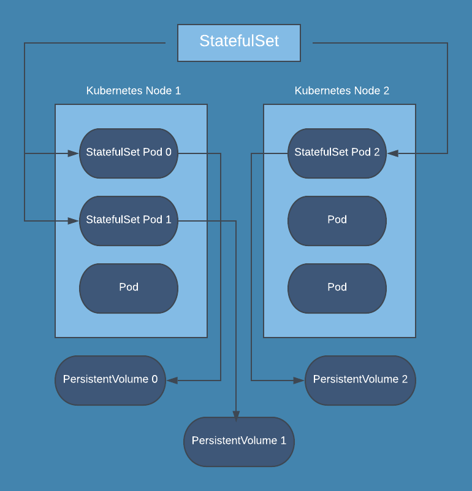

# 🗿 StatefulSet



Kubernetes'in stateless iş yükleri için, uygun bir platform olduğundan, state tutan iş yükleri için ise bir çok problem ile karşılaştığımızdan önceki bölümlerde söz etmiştik.&#x20;

Ephemeral ve Persistent volume konularında ise, bu sorunları ortadan kaldırmak adına, kullanabileceğimiz objeleri gördük ve işin depolama kısmını çözdük. Ancak stateful uygulamalarda, tek sıkıntımız depolama değil. Bunu çözmüş olsak da, şu ana kadar işlediğimiz obje tipleri diğer sorunlarımızı çözmüyor.&#x20;

İşte bu durum ile başa çıkmamıza yardımcı olacak obje tipi olan, statefulSet objesinden bahsedeceğiz.

Sorun nedir?

İlk olarak kendimize sorun oluşturalım; 3 pod oluşturacak, bir deployment objesi oluşturduğumuzu düşünelim. Bu deployment objesi, bildiğiniz üzere bir replicaset oluşturuyor ve bu replicaset 'de, bizim belirlediğimiz tanıma göre random isimler verilen, birbirinin aynısı podlar oluşturuyor.

Bu replicaset altında oluşturulan podların, birbirinden farkı yok. Ve bu nedenle kubernetes bunlara eşit davranıyor. Biz bu deployment objesini, yukarı doğru scale ettiğimiz zaman, istediğimiz sayıda yeni pod ekleniyor ve aşağı doğru scale edersek de, bu sefer bu podlardan istediğimiz sayıda pod **rastgele** olarak siliniyor.&#x20;

Yani 5 podlu deployment objesini, 3 pod'a indirmek istersek, kubernetes ilk hangisi yaratılmış, hangisi diğerinden önce yaratılmış vb şeylere bakmıyor ve rastgele olarak 2 podu siliyor. Podlar üzerinde herhangi bir state tutulmadığı için bu durum sıkıntı yaratmıyor. &#x20;

Fakat şöyle bir senaryo da,

Misal, yeni nesil noSQL veritabanlarından birini kubernetes üzerinde deploy etmek istiyoruz. Bu veritabanları hemen, hemen hepsi şu şekilde çalışır. Bir adet master instance bulunur ve bunun üzerinden bir cluster oluşturulur. Ardından bu cluster'a yeni instance'lar ekleriz. Yazma işlemlerini master üzerinden yaparken, sorguları herhangi bir instance'a gönderebilirsiniz.

Tüm veri bu istancelar üstünde dağıtık şekilde durur.&#x20;

Böyle bir veritabanı alanı olan, apache cassandra 'yı 3 instance'dan oluşacak, bir cluster olacak şekilde şu ana kadar öğrendiğimiz obje tipleri ile kubernetes'e deploy ettiğimizi düşünün,&#x20;

Bunun için nasıl bir yol izleyeceğiz?

Cassandra master olacak instance'ı deploy edeceğiz, ardından buna bağlanarak yada başlangıç komutları ile cassandra uygulamasını master hale getirecek şekilde, bir cluster oluşturacağız. Sonrasında 2. instance oluşturacağız ve bu 2. instance bağlanıp, 1.instance'daki cassandra cluster'a  2.instance'ı dahil edeceğiz. Ardından 3.instance oluşturup, aynı işlemleri yapacağız. Böylelikle 3. instance ile bir cassandra cluster'mız olacak.

Kubernetes'de nasıl ayağa kaldıracağız?

Bu adımları takip ederek, Kubernetes de nasıl bu uygulamayı ayağa kaldıracağımıza bakalım,

İlk olarak singleton podlar şeklinde deploy etmeyi deneyelim, Master olacak instance oluşturacak pod tanımını yaptık içine PVC tanımı ekledik ki, cassandra verileri tutabilecek, bir  PV'ye sahip olabilsin. Pod ayağa kalktı, bunu master hale getirecek komutları, ya başlangıç komutu olarak yada sonrasında bağlanıp hallettik. Ardından 2. pod tanımı daha yaptık, bunu da, 2.instance olarak ayağa kaldırdık. Ardıdan 3.pod tanımını yapıp, ayağa kaldırdık. Ve böylelikle gerekli ayarları yaptıktan sonra, cluster ayağa kalktı.&#x20;

Ancak burada bir çok sorun var,&#x20;

\-İşlemler manuel ve zahmetli\
\-Singleton podların fail durumunu kontrol eden bir mekanizma yok.\
\-Yeni bir pod eklemek veya çıkarmak istersem, tüm süreci yönetiyorum.

SingletonPod işimize yaramadı, Peki deployment kullansak?

3 adet cassandra podu oluşturacak, deployment objesi oluşturduk ve deploy ettik. Bu deployment objesi 3 adet birbirinin aynısı pod oluşturdu ve hepsine rastgele bir isim verdi.  Problem şu ki, hepsi aynı anda oluşturuldu. Ben ilk oluşanı master olarak ayarlamak istesem de, ayarlayamam. Çünkü hepsi, bu sorun dersek, bu işlemleri manuel olarak yapalım. Bağlanıp, birini master'a çevirelim, Diğerlerine de tek, tek bağlanıp cluster'a kattık. Aradan zaman geçti, worker nodelardan birinde sıkıntı oldu ve cassandra podlarından birine erişilemiyor.&#x20;

Deployment objemiz tarafından yönetildiği için, sıkıntı değil, hemen yeni bir pod oluşturulur. Ama bu yeni pod tamamen rastgele bir isim alacak ve sıfırdan oluşacak. Misal bu bahsettiğimiz pod Master instance olarak ayarladığımız Pod ise ne yapacağız? Cluster bu durumda çökmüş olacak.

Yada şunu düşünün, scale down veya up işlemi yaptığımızda, kubernetes buraya rastgele bir pod ekleyecek veya rastgele olarak içlerinden birini silecek. Bunların hepsi stateless uygulamalar için problem değil, fakat gördüğünüz üzere cluster uygulamaları vb stateful uygulamalardan oluşan clusterlar kurmak istersek, mevcut kubernetes objeleri sıkıntımızı çözmüyor.


Tüm bu sıkıntıları çözmek adına, statefulset adında bir obje mevcuttur.

* Statefulset tarafından oluşturulan her pod, statefulset tanımında belirlediğimiz PVC'ye göre bir PV'ye sahip olur. Yani her podun kendine ait bir PV'si olur.
* Statefulset altında, podlar sırayla oluşturulup, sırayla silinir. Misal 3 podlu bir stateful oluşturduğumuz zaman, öncelikle pod0 oluşturulur. Ve bu pod ayağa kalkıp, readiness ve liveness checklerinden geçip, işlemlerini tamamlamadan bir sonraki pod oluşturulmaz. Ne zaman pod hazır ve running duruma geçer, o zaman bir sonraki pod oluşturulur.  Aynı şekilde 3.podda 2.pod tamamlanmadan oluşturulmaz. Tam tersi durumda da bu geçerlidir. Biz 3 podlu bir statefulseti 2 poda indirirseniz, kubernetes random bir pod seçip, onu silme yoluna gitmez.  En son yaratılan pod hangisi ise, ilk olarak o silinir.&#x20;
* Statefulset tarafından oluşturulan her pod'a statefulsetismi-0 1 2 3 şeklinde devam eden, sabit bir isim verilir. İsimler random seçilmez ve bu isimler aynı zamanda containerların hostname olarak da ayarlandığı için, her uygulama bu isimle ulaşabilir.&#x20;

Statefulset objesi, deployment objesine oldukça benzerdir. Yukarıda bahsettiğim özellikler haricinde aynıdır. Bu özellikler sayesinde, bizlerin stateful uygulamaları deploy etmemiz oldukça kolaylaşır.

Az önceki cassandra örneğini statefulset ile ayağa kaldıracak olursak,  3 pod oluşturacak bir statefulset objesi yaratıp, deploy ettik. Kubernetes hemen ilk podu ayağa kaldırdı. Biz bu poda başlangıç scripti eklemiştik. Bu script ortamda bizim belirlediğimiz isimde cluster var mı? yok mu? bunu kontrol ediyor. Ve yoksa bu isimle bir cluster oluşturuyor. Script çalıştı, ortamda bu isimle cluster olmadığı için, cassandra cluster'ı oluşturuldu. Liveness ve readiness probe tamamlandı ve artık hem cluster, hem de podumuz hazır.

Birinci pod sağlıklı şekilde çalışmaya başladığı anda Kubernetes 2.podu da oluşturmaya başladı, Bu podda da, aynı script var, ama bu sefer ortamda böyle bir cluster mevcut, dolayısıyla yeni bir cluster oluşturmak yerine, bu mevcut cluster'a dahil oldu. Liveness ve readiness probe tamamlandı ve bu pod hazır.&#x20;

Bu pod'da hazır olduğu için 3.pod da oluşturulmaya başlandı, onda da aynı işlemler uygulandı ve cluster ayağa kalktı.&#x20;

Şimdi bu podlardan, cassandra-1 podu silinirse, statefulset objesi, aynı podu, aynı isimle tekrar ayağa kaldırıp, aynı PV bu poda atanacak. ve sorun olmayacak.&#x20;

Yada yeni pod eklersek, yeni identy olacak ve aynı şekilde cluster'a katılacak. Scale down olursa da, herhangi birini seçip, silmek yerine en son oluşturulan silinecek. Gördüğünüz gibi, cassandra cluster oluşturma problemini bu özellikleri sayesinde "statefulset" ile çözebildik.&#x20;

Örnek statefulset objesi yaml içeriği,

```yaml
apiVersion: v1
kind: Service
metadata:
  labels:
    app: cassandra
  name: cassandra
spec:
  clusterIP: None
  ports:
  - port: 9042
  selector:
    app: cassandra
---
apiVersion: apps/v1
kind: StatefulSet
metadata:
  name: cassandra
  labels:
    app: cassandra
spec:
  serviceName: cassandra
  replicas: 3
  selector:
    matchLabels:
      app: cassandra
  template:
    metadata:
      labels:
        app: cassandra
    spec:
      terminationGracePeriodSeconds: 1800
      containers:
      - name: cassandra
        image: gcr.io/google-samples/cassandra:v13
        imagePullPolicy: Always
        ports:
        - containerPort: 7000
          name: intra-node
        - containerPort: 7001
          name: tls-intra-node
        - containerPort: 7199
          name: jmx
        - containerPort: 9042
          name: cql
        resources:
          limits:
            cpu: "500m"
            memory: 1Gi
          requests:
            cpu: "500m"
            memory: 1Gi
        securityContext:
          capabilities:
            add:
              - IPC_LOCK
        lifecycle:
          preStop:
            exec:
              command: 
              - /bin/sh
              - -c
              - nodetool drain
        env:
          - name: MAX_HEAP_SIZE
            value: 512M
          - name: HEAP_NEWSIZE
            value: 100M
          - name: CASSANDRA_SEEDS
            value: "cassandra-0.cassandra.default.svc.cluster.local"
          - name: CASSANDRA_CLUSTER_NAME
            value: "K8Demo"
          - name: CASSANDRA_DC
            value: "DC1-K8Demo"
          - name: CASSANDRA_RACK
            value: "Rack1-K8Demo"
          - name: POD_IP
            valueFrom:
              fieldRef:
                fieldPath: status.podIP
        readinessProbe:
          exec:
            command:
            - /bin/bash
            - -c
            - /ready-probe.sh
          initialDelaySeconds: 15
          timeoutSeconds: 5
        volumeMounts:
        - name: cassandra-data
          mountPath: /cassandra_data
  volumeClaimTemplates:
  - metadata:
      name: cassandra-data
    spec:
      accessModes: [ "ReadWriteOnce" ]
      storageClassName: standard
      resources:
        requests:
          storage: 1Gi
```

Replicas sayımızı belirtiyor ve label selector'a dikkat ediyoruz. Ardından template kısmında ise, oluşturulmasını istediğimiz pod tanımını giriyoruz. template içeriği kullandığımız image'a göre değişir.

Template kısmı haricinde, en altta "VolumeClaimTemplates" kısmı mevcut. Burada her bir pod için, bu özelliklerde bir PVC oluşturulmasını söylüyoruz.  Bu PVClerde standart isimli storage class'ı kullanarak, her bir pod için birer PV oluşturacak.&#x20;

Yani her podun, aynı PV'ye bağlanması yerine, her pod'a ayrı bir PV oluşturulacak. PVCleri VolumeClaimTemplates ile yaratıyoruz. PVCleri dahi kendimiz manuel olarak oluşturmuyoruz. statefulset objesini oluşturduğumuz zaman, PVC oluşturulacak, PVClerde gidecek PVleri oluşturup, podlara tek, tek bağlayacak.

En üst kısımda "service" tanımı mevcut, gördüğünüz gibi şu ana kadar oluşturduğumuz service tanımına oldukça benzer. Fakat tek fark mevcut, clusterIP=none olarak set edilmiş. Buna headless services diyoruz. Bunu oluşturduğumuz anda, ClusterIP tipinde, bir servis oluşturulacak, Fakat ana bir IP adresi atanmayacak. Bu bize şu konuda yardımcı oluyor; Ben ne zaman, bu servis ismine gitmek istersem, o bana bu servis altındaki podlardan bir tanesinin IP adresini dönecek. Bunun yanında her bir podda da, podismi.serviceismi şeklinde erişme imkanı sağlamış olacak.


