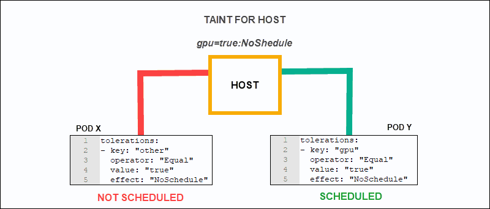

# ✍ Taint and Toleration


3 worker node 'dan oluşan bir cluster yapısı düşünelim. Worker nodelarımızdan birine color=blue diğer node da color=green labelları ekledik. 3. worker node da ise herhangi bir label eklemedik.&#x20;

Bu cluster üzerinde 2 uygulama deploy edeceğiz, blue uygulamamızı, blue olarak etiketlenen worker node da, green uygulamamızı da green olarak etiketlenen worker node da schedule edilmesini istiyoruz.

Bu nedenle gerekli pod affinity ve node affinity tanımlarını yaptık ve uygulamalarımızı deploy ettik. Blue uygulamamız node affinity tanımları gereği color=blue etiketli worker node da, green uygulamamız color=green şeklinde etiketlenen worker node da çalışmaya başladı. Yani istediğimiz gibi oldu.

Şimdi iste, aynı cluster da başka bir ekibin daha, bir uygulama deploy ettiğini düşünelim. Onlarda tanımlarını yaptılar ve kubernetes api'na gönderdiler. Podlar schedule edilmeye başlandı ve bazı podlar blue olarak etiketlenmiş worker node da, bazı podlar green olarak etiketlenmiş worker node da, bazı podlar da sonuncu worker node da çalışmaya başladı.

Bu istediğimiz bir durum ise, bunda bir sıkıntı yok elbette. Kubernetes sıradan en uygun nodeları seçip, yeni iş yüklerini buralarda çalıştırmaya başlayacak.

Fakat biz, color=blue olarak işaretlenmiş worker node üzerinde sadece blue uygulamasının çalışmasını istiyorsak veya green olarak etiketlenmiş node da sadece green uygulaması çalışsın istiyorsak bunu node affinity veya pod affinity ile sağlayamayız. Affinity tanımları bir podun nerede schedule edileceğini belirtir. Yani pod'a göre bir tanımdır.

Bizim ihtiyacımız misal, şu, şu worker nodelarda sadece şu tipte uygulamalar çalışsın ise, affinity bunu sağlamaz.&#x20;

Misal bizim 10 node dan oluşan bir clusterımız var, Bu 10 node dan, 3 tanesi en hızlı işlemcilere, en yüksek ram kapasitesine ve hızlı disklere sahip, diğer 7 node ise bunlara göre daha yavaş, bu durumda şunu isteyebiliriz. Sadece müşterilerimize dönük uygulamalarımız bu hızlı nodelar üzerinde çalışsın, test uygulamalarımız veya düşük öncelikli uygulamalarımız hiç bir zaman bu hızlı worker nodelarda schedule edilip, kaynakları boşuna tüketmesin. Yani uzun lafın kısası, sadece belirli tipte podlar bu hızlı nodelar üzerinde schedule edilebilsin.&#x20;

Bu tür tanımları taint ve toleration tanımlarıyla gerçekleştirebiliyoruz. Biz bir worker node'a anahtar veri eşlenikleri şeklinde bir taint ve bu taint ile birlikte NoSchedule|PreferNoSchedule|NoExecute olmak üzere bir emir ekleriz. Bu aşamadan itibaren, bu node üstünde, sadece bu tainti, yani bozukluğu tolere edecek podlar çalışır.

Örneğin, ben bir worker node a "platform=production:NoSchedule şeklinde bir taint eklersem, bu tainti tolere edecek bir tanım eklenmemiş hiç bir pod, bu node üzerinde schedule edilemez.&#x20;

Aynı şekilde, "platform=production:PreferNoSchedule" şeklinde bir tanım eklersek,  bu seferde mümkünse, bunu tolere edemeyen hiç bir pod bu worker node üzerinde schedule edilemez. Ama ilgili pod için uygun başka bir node bulunamazsa da, Son seçenek olarak bu worker node üstünde pod çalıştırılır.&#x20;



NoExecution ise, dikkatli kullanılması gereken bir seçenektir. Ben bir worker node a "platform=production:NoExecution" şeklinde bir taint tanımı girersem, bu tainti tolere edemeyen hiç bir pod burada schedule edilemez ve mevcut durumda worker node üzerinde bu tainti tolere edemeyen pod ve podlar varsa, ilgili podlar bu worker node üzerinden silinerek, başka uygun worker nodelarda yeniden oluşturulur.

Node'lara taint ekleme.

```bash
kubectl taint node "node_ismi" "anahtar=değer:eylem"

Ör: kubectl taint node worker-1 platform=production:NoSchedule
```

Yukarıdaki komutla şunu diyoruz, eğer bir pod tanımında, "platform=production:NoSchedule" şeklinde bir toleration tanımı yoksa, o pod burada schedule edilemeyecek.

Node'lardan taint kaldırma.

```bash
kubectl taint node "node_ismi" "anahtar-"

Ör: kubectl taint node minikube platform-
```

Örnek bir Toleration kullanımı;

```yaml
apiVersion: v1
kind: Pod
metadata:
  name: toleratedpod1
  labels:
    env: test
spec:
  containers:
  - name: toleratedcontainer1
    image: alpine
  tolerations:
  - key: "platform"
    operator: "Equal"
    value: "production"
    effect: "NoSchedule"
---
apiVersion: v1
kind: Pod
metadata:
  name: toleratedpod2
  labels:
    env: test
spec:
  containers:
  - name: toleratedcontainer2
    image: ubuntu
  tolerations:
  - key: "platform"
    operator: "Exists"
    effect: "NoSchedule"
```

1. pod tanımında gördüğünüz gibi, bu podun tolere edebileceği taint tanımı toleration kısmında aynı taint tanımı ekler gibi eklenmiş. Key kısmına anahtar, operator kısmına Equal yani eşittir. Value kısmınada değeri giriyoruz. Ardından da effect kısmına aynı effecti giriyoruz. Bu podun tainti tolere edebilmesi için, birebir aynı tolerations tanımının yapılması gerekiyor. Biz de bu pod tanımında bunu sağlamış oluyoruz.
2. pod tanımında ise, bu sefer key kısmında anahtar var, fakat value kısmı yok, Onun yerine operator kısmına "Exists" girilmiş.  "Effect" kısmı ise aynı, bu da şu demek, Eğer Platform ve NoSchedule olarak girilmiş bir taint tanımı varsa, bunu tolere et. Yani değeri önemli değil.

Tolerations kısımları bu şeklilde, neyi tolere edeceksek, onun aynısını tolerations kısmına giriyoruz. Taint ve tolerations node affinity'nin yaptığını yapmaz. Bir poda git şu taintin olduğu yerde schedule ol demez, Tolerations sadece şunu der; Eğer scheduler podu schedule etmek için seçtiği node üstünde, bu taint varsa onu tolere edebilirsin. Yani bu pod şurada oluşturulsun node affinity'nin işidir. Worker node üzerinde sadece şu podlar çalışabilsin taint ve tolerations'un işidir.
