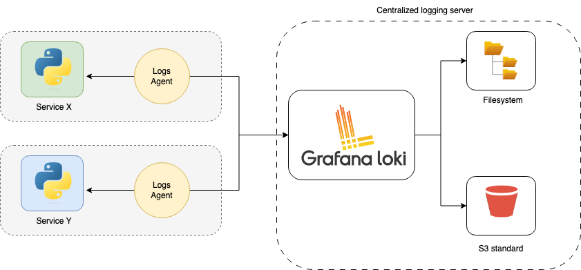

# Architecture of Loki

<figure><figcaption></figcaption></figure>

#### 1. Log’ları Toplamak İçin Agent’lar

* **Promtail**: Grafana ekosistemi tarafından Loki için özel olarak geliştirilen bir log toplama aracıdır.
* **FluentD, Logstash vb.**: Loki, Promtail haricindeki yaygın log toplama çözümleriyle de **entegrasyon** sunar. Yani mevcut log altyapınızı tamamen değiştirmek zorunda değilsiniz.

Bu araçlar (agent’lar), **sunucu üzerinde** çalışan uygulamaların veya işletim sisteminin ürettiği log’ları toplayıp **Loki’ye** gönderir.

#### 2. Loki’ye Giden Veri: Loglar + Etiketler (Labels)

* Agent tarafından toplanan her bir log satırı, yanında **etiketler** (labels) adı verilen **metaveri** bilgileriyle birlikte Loki’ye ulaşır.
  * Örnek etiketler: `{ job="syslog", env="production", app="frontend" }`
* **Loki sadece etiketleri indeksler**, log metninin tamamını değil. Log içeriği ise “chunk” adı verilen bloklarda **sıkıştırılmış** biçimde saklanır.
  * Bu yöntem, özellikle indeks boyutunu küçük tutarak hem performansa hem de maliyete olumlu yansır.

#### 3. Depolama Seçenekleri

* **Yerel Dosya Sistemi (Filesystem)**: Dilerseniz Loki’nin kurulu olduğu sunucunun diskinde depolama yapabilirsiniz; ancak büyük ölçekli loglar için yönetimi zorlaşabilir.
* **Nesne Depolama (Object Storage)**: AWS S3, MinIO gibi sistemlerde log “chunk”larını saklamak mümkündür.

Bu sayede, Elasticsearch gibi bir tam metin indeks veritabanını yönetmek yerine, Loki veriyi **daha ucuz** bir biçimde saklar.

#### 4. Sorgulama (Query) ve LogQL

* Log’lara erişmek ve analiz etmek için **LogQL** adında özel bir sorgu dili kullanılır.
  * Örnek sorgularla belirli etiketlere, zaman aralıklarına veya içerik parçalarına göre filtre yapılabilir.
* **Grafana Entegrasyonu**: Loki, Grafana ile **doğrudan** entegre olur ve “Data Source” olarak eklenebilir.
  * Böylece GUI üzerinden (Grafana arayüzü) LogQL sorguları yazılabilir, sonuçlar görsel olarak incelenebilir.

#### 5. Senaryo: Birden Fazla Sunucudan Log Toplama

* Birkaç farklı sunucudan (örneğin node-1, node-2) agent’lar aracılığıyla loglar toplanıp **tek bir Loki servisine** gönderilebilir.
* Loki, gelen logları etiketleriyle birlikte kabul eder ve uygun depolama altyapısına kaydeder.
* Sonrasında herhangi bir sorun veya hata analizi gerekince, LogQL sorgularıyla ilgili log satırlarına hızla erişilebilir.

