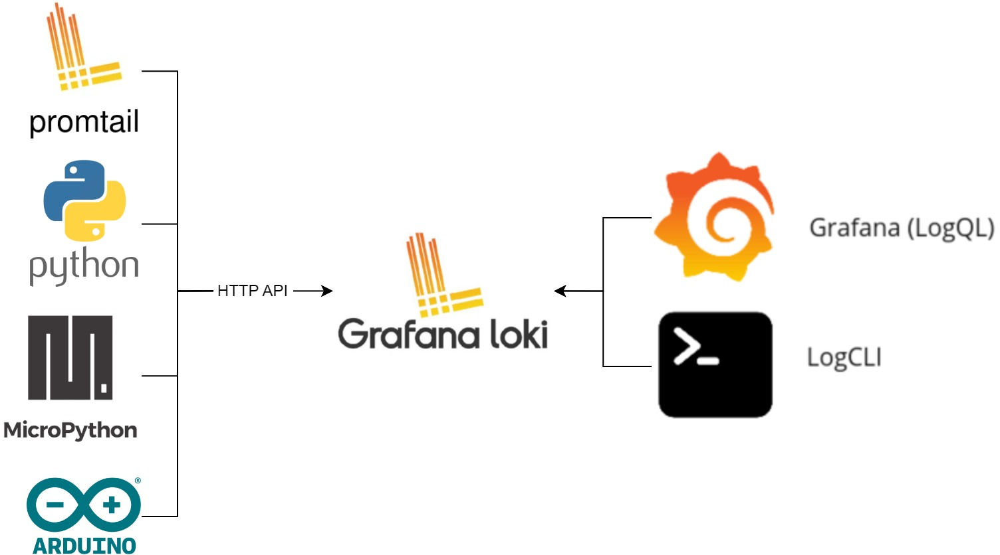

# What is Loki?

<figure><figcaption></figcaption></figure>

Loki, log’ları (uygulamalarınızdan ve altyapınızdan gelen tüm log kayıtlarını) saklamak ve sorgulamak üzere tasarlanmış, “log aggregation” (log toplama) sistemidir.&#x20;

Loki, tıpkı Elasticsearch gibi log’larınızı merkezî bir yerde toplar. Ancak en büyük farkı, log metinlerinin tamamını indekslemek yerine yalnızca **log etiketlerini (labels)** indeksler. Bu sayede indekslenecek veri miktarı önemli ölçüde azalır ve performans artar.

**Nasıl çalışır?**

* Log’larınız, Loki’ye gönderilirken yanında bazı **etiketler (labels)** de gönderir. Örnek etiketler: `app`, `env`, `hostname`, `region` vb.
* Loki, bu etiketleri indeksleyerek log’larınızı hızlıca filtrelemenize ve istediğiniz zaman sorgulamanıza olanak tanır.
* Metin içeriği, yani esas log mesajları saklanır ama indekslenmez. İhtiyaç duyduğunuzda, ilgili zaman aralığındaki log’ları etiketler yardımıyla filtreleyerek inceleyebilirsiniz.

**Prometheus benzerliği**

* Loki, Prometheus ekosistemine ait bir çözüm olarak görülebilir.
* Konfigürasyon mantığı ve sorgu dili (Loki’nin kullandığı sorgu dili `LogQL`), Prometheus kullanıcılarının aşina olacağı bir yaklaşıma sahiptir. Böylece Prometheus deneyimi olan birisi, Loki’yi de kolaylıkla kavrayabilir.

**Ne zaman kullanılır?**

* Uygulamalarda veya altyapıda bir hata (örneğin prod ortamında bir çökme veya beklenmeyen bir davranış) oluştuğunda, Loki’den ilgili zaman aralığını seçerek detaylı log sorguları yapabilirsiniz.
* Mikroservis tabanlı mimarilerde pek çok farklı kaynaktan log toplamak zor olabilir. Bu gibi durumlarda tüm log’ları merkezîleştirmek için Loki oldukça kullanışlıdır.

Özetle, **Loki**, **düşük maliyetli**, **kolay yönetilebilir** ve **hızlı** bir log toplama ve sorgulama çözümüdür. Bunu da **yalnızca etiketleri indekslemesi** sayesinde elde eder.&#x20;
