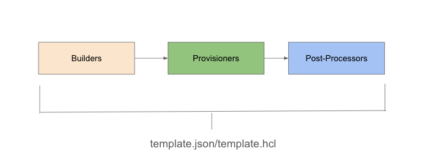

# Post-Processors

<figure><figcaption></figcaption></figure>

#### 1. Post-Processor Nedir? (Lojistik Ekibi)

Hatırlarsan; Builder keki pişirdi (makineyi açtı), Provisioner keki süsledi (yazılımları kurdu). Artık elimizde bir Artifact (Ürün) var. Ama bu ürün fırının tezgahında duruyor. Post-Processor devreye girer ve şunları yapar:

* "Bu ürünü kutulayalım mı?" (Sıkıştırma)
* "Müşteriye kargolayalım mı?" (Upload)
* "Üzerine barkod yapıştıralım mı?" (Manifest)

Yani, oluşan Image'ı Deploy edilmeye (dağıtılmaya) hazır hale getirir.

#### 2. Manifest: "Elimizde Ne Var?" Fişi

* Sorun: Packer AWS'de bir Image oluşturdu ve AWS buna rastgele bir isim verdi (örn: `ami-0abcdef12345`). Peki, senin altyapını kuran diğer araç (örneğin Terraform) bu ID'yi nereden bilecek?
* Çözüm: Post-Processor, işlem bitince bir `manifest.json` dosyası oluşturur. İçine "Ben AWS'de şu ID ile, şu tarihte bir Image oluşturdum" diye yazar.
* Otomasyon (CI/CD): Sonraki adımlarda (Pipeline), Terraform gelir bu dosyayı okur ve "Ha, tamam, kullanmam gereken yeni Image buymuş" der. Bu, tam otomasyonun kilit noktasıdır.

#### 3. Dönüştürme ve Arşivleme (Format & Upload)

Bazen ürettiğin Image ham haldedir ve onu işlemen gerekir:

* Format Değiştirme: Örneğin VMware için bir Image yaptın ama bunu geliştiricilerin kendi bilgisayarlarında (Vagrant ile) kullanmasını istiyorsun. Post-Processor bunu alır, bir "Vagrant Box" formatına çevirir.
* Sıkıştırma (Compress): Dosya çok büyükse zipler/sıkıştırır.
* Upload: Dosyayı senin bilgisayarından veya Build sunucusundan alır; şirketin ortak deposuna (Artifactory) veya Bulut depolama alanına (S3, Azure Blob) yükler.

#### 4. İş Akışındaki Yeri

Packer konfigürasyon dosyasında (HCL2) sıra her zaman şöyledir:

1. Build: (İnşaat)
2. Provision: (İç Dekorasyon)
3. Post-Process: (Paketleme ve Sevkiyat)

Dosya tanımlayıcı (File descriptor) sınırı uyarısı ise şudur: Eğer aynı anda yüzlerce kutuyu paketlemeye çalışırsan (çok fazla Post-Processor çalıştırırsan), işletim sistemi "Yeter artık, elim kalmadı" diyebilir. Ancak başlangıç seviyesinde buna takılman çok düşük ihtimaldir.

***

Özetle: Post-Processor, oluşan teknik çıktıyı (Image/Artifact), diğer insanların veya diğer yazılımların kullanabileceği, düzenli ve erişilebilir bir hale getiren "Teslimat" sürecidir. Ürünü raftaki yerine koyan son adımdır.
