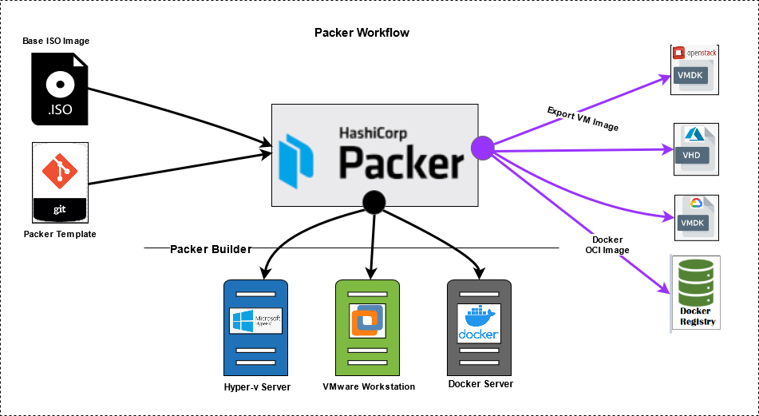

# Provisioners

<figure><figcaption></figcaption></figure>

#### 1. Provisioner Nedir?

Önceki adımda Builder bize boş bir ev (sanal makine) yapmıştı. Provisioner ise o evin içine girip boyayı yapan, mobilyaları yerleştiren, elektrik tesisatını döşeyen ekiptir.

* Builder: Makineyi açar (Boot eder).
* Provisioner: Makine çalışırken (Run-time) içine girer; Nginx kurar, Python yükler, senin kodlarını kopyalar, ayar dosyalarını düzenler.
* Sonuç: Makine kapatılıp paketlenmeden (Artifact olmadan) hemen önceki son halini verir.

#### 2. Hangi Provisioner Kullanılır?

Packer sana "İçeriyi nasıl döşemek istersin?" diye sorar ve sana farklı aletler sunar:

* Shell / PowerShell: En basiti. Sanki terminale komut yazar gibi `apt-get install nginx` veya `git clone ...` komutlarını çalıştırır. Yeni başlayanlar genelde bununla başlar.
* File Provisioner: Bilgisayarından sunucuya dosya (konfigürasyon dosyası, SSL sertifikası vb.) kopyalamak için kullanılır.
* Ansible / Chef / Puppet: Eğer çok karmaşık bir kurulum yapacaksan (örneğin 50 farklı ayar, kullanıcı izinleri, karmaşık veritabanı kurulumları), basit shell komutları yerine bu Configuration Management (Yapılandırma Yönetimi) araçlarını Packer ile konuşturabilirsin.

#### 3. "Baking" ve Değişmezlik

* Eski Kafa (Mutable): Bir sunucu kurarsın. Sonra içine girip Java güncellersin, sonra bir ayar değiştirirsin. Zamanla o sunucu "yama bohçasına" döner ve kimse neyin nerede olduğunu bilemez (Buna Configuration Drift denir).
* Packer Kafası (Immutable/Baking): Sen yemeği (Sunucuyu) Provisioner ile hazırlarsın ve fırına verirsin. Yemek piştikten sonra (Image oluştuktan sonra) üzerine tuz, biber eklemezsin.
  * _Değişiklik mi lazım?_ Yemeği düzeltmeye çalışma; tarifi değiştir ve yeni bir yemek pişir (Yeni Image oluştur).
  * Bu sayede, "Acaba prod ortamındaki sunucuda şu kütüphane yüklü müydü?" diye düşünmezsin. Çünkü Image neyse, sunucu odur.

#### 4. Troubleshooting

* Yarış Durumu (Race Condition) / Cloud-Init:
  * _Sorun:_ Sen AWS'de makineyi açar açmaz Packer "Hadi Nginx kuralım!" diye atlayabilir. Ama makine daha "Ayılıyorum, bekle" diyordur (Arka planda cloud-init çalışıyordur). Bu durumda kurulum patlar.
  * _Çözüm:_ Provisioner'ların en başına "Bekle kardeşim, makine tam açılsın" diyen bir komut veya bekleme süresi koymak gerekir (`cloud-init status --wait` gibi).
* Debug Mode:
  * Builder kısmında olduğu gibi, eğer Provisioner bir yerde hata verirse, Packer sana geçici bir anahtar (.pem) verir. "Gir bak bakalım, neden yüklenmedi bu dosya?" diye inceleme şansı tanır.

***

Özetle: Provisioner, boş gelen sanal makineyi, senin istediğin özelliklere sahip, hazır bir sunucuya dönüştüren kurulum ve konfigürasyon adımıdır. Packer'ın "Image" oluşturmadan önceki süsleme sanatıdır.
