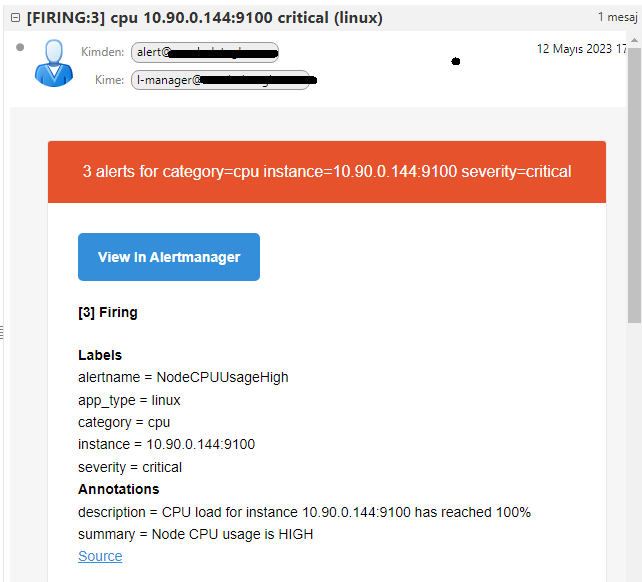
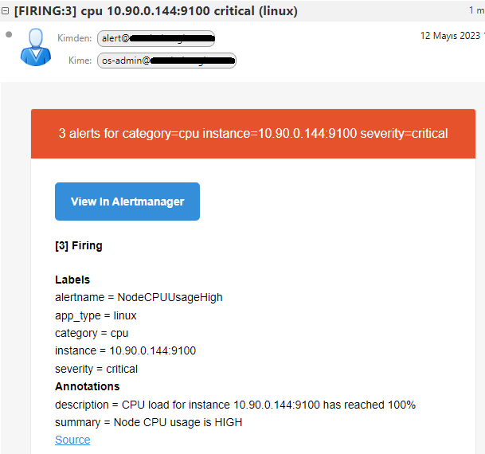

# ⌚ Alert Routing

```yaml
global:
  smtp_from: 'alert@example.com'
  smtp_smarthost: mail.example.com:587
  smtp_auth_username: 'alert@example.com'
  smtp_auth_identity: 'alert@example.com'
  smtp_auth_password: '12as45!!6'

route:
  # Fallback receiver
  receiver: admin
  routes:
    # Star solutions
    - match_re:
        app_type: (linux|windows)
      receiver: os-admin

receivers:
  - name: admin
    email_configs:
      - to: 'admin@example.com'
  - name: os-admin
    email_configs:
      - to: 'os-admin@example.com'

```

Yukarıdaki YAML dosyasında, "route" bölümü, iki anahtar kelime içerir: "receiver" ve "routes". "receiver" anahtar kelimesi, tüm etiket eşlemelerine uymayan hedefler için varsayılan bir alıcı adını belirtir. Bu durumda, varsayılan alıcı adı "admin" olarak belirlenmiştir.

"routes" anahtar kelimesi, etiketlerin belirli bir değere eşleştiği hedefleri belirli bir alıcıya yönlendirmek için kullanılır. "match\_re" anahtar kelimesi, "routes" altında belirli bir etiket eşleşmesi tanımlar. Bu örnekte, "app\_type" etiketi, "linux" veya "windows" değerleriyle eşleştirilir. "receiver" anahtar kelimesi ise, "match\_re" ile eşleşen hedeflerin yönlendirileceği alıcıyı belirtir. Bu durumda, eşleşen hedefler "os-admin" alıcısına yönlendirilir.

Özetle, bu konfigürasyon, belirli bir uygulama türüne sahip hedeflerin Prometheus tarafından toplanan metriklerini "os-admin" alıcısına yönlendirir ve tüm diğer hedeflerin metriklerini "admin" alıcısına yönlendirir.

#### Örneğin,

<pre class="language-yaml"><code class="lang-yaml">groups:
  - name: linux-rules
    rules:

    - alert: NodeExporterDown
      expr: up{job="node_exporter"} == 0
      for: 2m
      labels:
        severity: critical
        <a data-footnote-ref href="#user-content-fn-1">app_type: linux</a>
        category: server
      annotations:
        summary: "Node Exporter is down"
        description: "Node Exporter is down for more than 2 minutes"

</code></pre>

Yukarıdaki örnekte `app_type: linux` etiketine sahip olan hedefler için bir alarm kuralları tanımlanmıştır. Bu alarm kurallarına göre, `app_type: linux` etiketine sahip hedeflerde Node Exporter'in çalışmaması durumunda bir alarm oluşturulacaktır.

Bu alarm oluşturulduğunda, Prometheus yöneticisi, alarmın "labels" (etiketler) bölümünde belirtilen `app_type: linux` etiketine sahip olan alıcılara bir uyarı mesajı gönderebilir. Yönlendirme kurallarınızda, "app\_type: linux" etiketine sahip hedefler için bir alıcı belirleyebilir ve uyarı mesajlarını bu alıcıya yönlendirebilirsiniz.

Örneğin, yukarıdaki örnekte yönlendirme kurallarında `app_type: linux` etiketine sahip hedefler için "os-admin" adında bir alıcı belirtilmiştir. Bu nedenle, Node Exporter'in çalışmaması durumunda, Prometheus, bu alıcıya bir uyarı mesajı gönderecektir.


#### Expert level;

```yaml
global:
  smtp_from: 'alert@example.com'
  smtp_smarthost: mail.example.com:587
  smtp_auth_username: 'alert@example.com'
  smtp_auth_identity: 'alert@example.com'
  smtp_auth_password: 'JhwhGb3231333374Zjq6U'

route:
  # fallback receiver
  receiver: admin
  routes:
    # Star Solutions.
  - match_re:
      app_type: (linux|windows)
    # fallback receiver
    receiver: os-admin
    routes:
    # Linux team
    - match:
        app_type: linux
      # fallback receiver
      receiver: linux-team-admin
      routes:
      - match:
          severity: critical
        receiver: linux-team-manager
      - match:
          severity: warning
        receiver: linux-team-lead

    # Windows team
    - match:
        app_type: windows
      # fallback receiver
      receiver: windows-team-admin
      routes:
      - match:
          severity: critical
        receiver: windows-team-manager
      - match:
          severity: warning
        receiver: windows-team-lead


receivers:
- name: admin
  email_configs:
  - to: 'admin@example.com'

- name: os-admin
  email_configs:
  - to: 'os-admin@example.com'

- name: linux-team-admin
  email_configs:
  - to: 'l-admin@example.com'

- name: linux-team-lead
  email_configs:
  - to: 'l-lead@example.com'

- name: linux-team-manager
  email_configs:
  - to: 'l-manager@example.com'

- name: windows-team-admin
  email_configs:
  - to: 'w-admin@example.com'

- name: windows-team-lead
  email_configs:
  - to: 'w-lead@example.com'

- name: windows-team-manager
  email_configs:
  - to: 'w-manager@example.com'
```

#### Alert Rules,





Öncelikle, tüm uyarılar varsayılan olarak "admin" adlı bir alıcıya yönlendirilir. Ancak daha sonra, "routes" bölümü tanımlanarak belirli bir ölçütün eşleşmesine göre uyarıların yönlendirileceği alıcı belirlenir.

Burada "routes" bölümünde bir "match\_re" etiketi kullanılarak uyarıların "linux" veya "windows" app\_type değerlerinden herhangi birine sahip olup olmadığı kontrol edilir. Eğer uyarıda bu etiketlerden biri varsa, "receiver" etiketi "os-admin" olarak belirlenir.

Sonra "routes" bölümü içinde, "match" etiketi kullanılarak app\_type değeri "linux" olan uyarılar için yeni bir yönlendirme tanımlanır. Bu yönlendirmede, "receiver" etiketi "linux-team-admin" olarak belirlenir.

Daha sonra, bir sonraki "routes" bölümünde, "match" etiketi kullanılarak uyarının "critical" bir öncelik seviyesine sahip olup olmadığı kontrol edilir. Eğer uyarı "critical" ise, alıcı "linux-team-manager" olarak belirlenir. Ancak eğer uyarı "warning" öncelik seviyesinde ise, alıcı "linux-team-lead" olarak belirlenir.

Aynı şekilde, app\_type değeri "windows" olan uyarılar için de aynı yapılandırma tanımlanır ve "windows-team-admin", "windows-team-manager" ve "windows-team-lead" gibi farklı alıcılar belirlenir.


#### App alert routing;

```yaml
global:
  smtp_from: 'alert@example.com'
  smtp_smarthost: mail.example.com:587
  smtp_auth_username: 'alert@example.com'
  smtp_auth_identity: 'alert@example.com'
  smtp_auth_password: 'JhwhWVWGb74Zjq6U'

route:
  # fallback receiver
  receiver: admin
  routes:
    # Star Solutions.
  - match_re:
      app_type: (linux|windows)
    # fallback receiver
    receiver: os-admin
    routes:
    # Linux team
    - match:
        app_type: linux
      # fallback receiver
      receiver: linux-team-admin
      routes:
      - match:
          severity: critical
        receiver: linux-team-manager
      - match:
          severity: warning
        receiver: linux-team-lead

    # Windows team
    - match:
        app_type: windows
      # fallback receiver
      receiver: windows-team-admin
      routes:
      - match:
          severity: critical
        receiver: windows-team-manager
      - match:
          severity: warning
        receiver: windows-team-lead

    # PEC Technologies.
  - match_re:
      app_type: (python|go)
    # fallback receiver
    receiver: pec-admin
    routes:
    # Python team
    - match:
        app_type: python
      # fallback receiver
      receiver: python-team-admin
      routes:
      - match:
          severity: critical
        receiver: python-team-manager
      - match:
          severity: warning
        receiver: python-team-lead

    # Go team
    - match:
        app_type: go
      # fallback receiver
      receiver: go-team-admin
      routes:
      - match:
          severity: critical
        receiver: go-team-manager
      - match:
          severity: warning
        receiver: go-team-lead

receivers:
- name: admin
  email_configs:
  - to: 'admin@example.com'

- name: os-admin
  email_configs:
  - to: 'os-admin@example.com'

- name: linux-team-admin
  email_configs:
  - to: 'l-admin@example.com'

- name: linux-team-lead
  email_configs:
  - to: 'l-lead@example.com'

- name: linux-team-manager
  email_configs:
  - to: 'l-manager@example.com'

- name: windows-team-admin
  email_configs:
  - to: 'w-admin@example.com'

- name: windows-team-lead
  email_configs:
  - to: 'w-lead@example.com'

- name: windows-team-manager
  email_configs:
  - to: 'w-manager@example.com'

- name: pec-admin
  email_configs:
  - to: 'pec-admin@example.com'

- name: python-team-admin
  email_configs:
  - to: 'pteamadmin@example.com'

- name: python-team-lead
  email_configs:
  - to: 'pteamlead@example.com'

- name: python-team-manager
  email_configs:
  - to: 'pteammanager@example.com'

- name: go-team-admin
  email_configs:
  - to: 'goteamadmin@example.com'

- name: go-team-lead
  email_configs:
  - to: 'goteamlead@example.com'

- name: go-team-manager
  email_configs:
  - to: 'goteammanager@example.com'
```

Yukarıdaki Alertmanager konfigürasyonunda, öncelikle genel bir fallback alıcı tanımlanıyor. Ardından, `match_re` anahtar kelimesi kullanılarak bir regex eşleşmesi yapılarak, `app_type` etiketi `python` veya `go` olarak eşleşirse, uyarı `pec-admin` alıcısına yönlendiriliyor.

&#x20;`app_type` etiketi `python` olarak eşleşirse, uyarı `python-team-admin` alıcısına yönlendiriliyor. Bu alıcıya giden uyarılar, eğer `severity` etiketi `critical` değerine sahipse `python-team-manager` alıcısına da yönlendiriliyor. `severity` etiketi `warning` ise `python-team-lead` alıcısına yönlendiriliyor.

Benzer şekilde, `app_type` etiketi `go` olarak eşleşirse, uyarı `go-team-admin` alıcısına yönlendiriliyor. Bu alıcıya giden uyarılar, eğer `severity` etiketi `critical` değerine sahipse `go-team-manager` alıcısına da yönlendiriliyor. `severity` etiketi `warning` ise `go-team-lead` alıcısına yönlendiriliyor.

Böylece, Alertmanager konfigürasyonu, `app_type` ve `severity` etiketleri gibi belirli uyarı özelliklerine göre yönlendirme yaparak, farklı ekipler ve kişiler arasında uyarıları doğru şekilde dağıtabiliyor.


`pec-admin` receiver'ı bir yönlendiricidir ve bu receiver'a bağlı olan yönlendirmeler belirli bir eşleşme kurallarına göre oluşturulur. Burada `match_re` ile `app_type` etiketi, değeri `python` veya `go` olan tüm uyarılar için eşleştirilir. Eşleşme sağlandığında, `pec-admin` receiver'ı kullanılır. Ancak `pec-admin` receiver'ı direkt olarak alarm mesajı almaz, sadece belirli bir eşleşme kuralı karşılandığında uygun olan yönlendirme kurallarına göre alarm mesajını diğer alıcılara yönlendirir. Bu nedenle, `pec-admin` kullanıcısına hiçbir alarm mesajı gönderilmeyecektir.



Alert Rules;



Aşağıdaki sayfa, Prometheus Alertmanager'ın routing ağacının bir görselleştirmesini sunan bir web aracıdır. Alertmanager konfigürasyonunun görsel olarak anlaşılabilir olmasını sağlar. Kullanıcıların bir konfigürasyon dosyasını açarak, ağacın her bir düğümüne tıklayarak, Alertmanager'ın hangi uyarıların hangi alıcılara gideceğini belirleyen routing kurallarını daha kolay anlamasına ve yönetmesine yardımcı olur. Ayrıca, kullanıcıların yeni routing kuralları oluşturması, mevcut kuralları düzenlemesi ve silmesi için kullanışlı bir arayüz sağlar.



```yaml
- name: windows-team-manager
  email_configs:
  - to: 'w-manager@example.com'
    send_resolved: true
```

\
`send_resolved` parametresi, Alertmanager'ın bir rota tanımında belirli bir alıcıya gönderilen herhangi bir bildirimin bir süre sonra çözümlendiğinde bu alıcıya bir "resolved" bildirimi gönderip göndermeyeceğini belirler. Bu nedenle, `send_resolved` parametresi bir rota tanımında belirtilir.

#### Alert Grouping

<pre class="language-yaml"><code class="lang-yaml">route:
  # fallback receiver
  receiver: admin
  routes:
    # Star Solutions.
  - match_re:
      app_type: (linux|windows)
    # fallback receiver
    receiver: os-admin
    routes:
    # Linux team
    - match:
        app_type: linux
      # fallback receiver
      receiver: linux-team-admin
      <a data-footnote-ref href="#user-content-fn-2">group_by: [category, instance, severity]</a>
      routes:
      - match:
          severity: critical
        receiver: linux-team-manager
      - match:
          severity: warning
        receiver: linux-team-lead

    # Windows team
    - match:
        app_type: windows
      # fallback receiver
      receiver: windows-team-admin
      <a data-footnote-ref href="#user-content-fn-3">group_by: [category, instance, severity]</a>
      routes:
      - match:
          severity: critical
        receiver: windows-team-manager
      - match:
          severity: warning
        receiver: windows-team-lead
</code></pre>

"group\_by" alanı, bir alarmın birden fazla etikete veya özniteliğe sahip olması durumunda, alarmı farklı kategorilere, örneğin kritiklik seviyesine veya uygulama örneğine göre gruplandırmak için kullanılır. Bu, alarmların daha düzenli bir şekilde yönetilmesine yardımcı olur ve uygun ekiplerin doğru kişilere yönlendirilmesini sağlar.

Bu örnekte, "group\_by" alanı "category", "instance" ve "severity" etiketleri ile tanımlanmıştır. Örneğin, eğer bir Linux uygulaması bir hata verirse ve bu hata "critical" seviyesindeyse, alarm "linux-team-manager" alıcısına yönlendirilir. "group\_by" alanı, ayrıca, bir alarma birden fazla etiket atandığında bu etiketlerin hepsine göre bir gruplama yapar.

Bu örnek senaryoda, "group\_by" alanı özellikle büyük ölçekli ağlarda veya uygulamalarda alarmların daha etkili yönetimi için önemlidir.

<figure><figcaption><p>Görsel de göreceğizi üzere, kategori-instance-önem derecesine göre gruplayıp, maili göndermiş.</p></figcaption></figure>

#### Throttling & Repetition

Throttling ve repetition özellikleri, Alertmanager'ın bir alarmın tekrarlanması ve/veya alarm mesajlarının sıklığıyla ilgili olarak nasıl davranacağını kontrol etmek için kullanılan özelliklerdir.

Throttling, bir alarmın tekrarlanma sıklığını kontrol etmek için kullanılır. Özellikle, bir sistemde meydana gelen kritik bir hatanın bildirimi için yapılan bir alarmın, belirli bir süre içinde tekrar gönderilmesinin önüne geçilmesi gerekebilir. Bu durumda, Throttling özelliği kullanılır. Throttling, aynı alarmın tekrar gönderilmesini belirli bir süre boyunca engelleyebilir veya azaltabilir. Bu sayede, birden fazla alarmın gönderilmesi ve gereksiz yere alıcıların rahatsız edilmesi önlenir.

Repetition ise, bir alarmın belirli aralıklarla tekrar gönderilmesi için kullanılır. Örneğin, bir hizmetin çalışmasını doğrulayan bir alarm, belirli aralıklarla gönderilerek sistemdeki mevcut durumun takibi sağlanabilir. Bu sayede, eğer bir hatanın ortaya çıkması durumunda, alıcılar tekrarlanan mesajlar sayesinde hızlı bir şekilde tepki verebilirler.

#### group\_wait & group\_interval

Diyelim ki Prometheus, CPU kullanımını ölçen bir uyarı kuralına sahip. CPU kullanımı %80’in üzerinde olan her sunucu için bir uyarı gönderir. Alertmanager, bu uyarıları gruplamak için alertname ve job etiketlerine göre gruplar. Yani aynı işte çalışan ve aynı uyarı adına sahip olan sunucular tek bir grupta olur.

Alertmanager, <mark style="color:red;">group\_wait: 30s</mark> olarak ayarlanmışsa, aynı gruptaki uyarıları 30 saniye boyunca bekletir. Bu süre içinde yeni uyarılar gelirse, gruba eklenir. 30 saniye sonra, Alertmanager gruptaki tüm uyarıları bir bildirim olarak gönderir.

Alertmanager, <mark style="color:red;">group\_interval: 5m</mark> olarak ayarlanmışsa, bir gruba bildirim gönderdikten sonra 5 dakika bekler. Bu süre içinde yeni uyarılar gelirse, gruba eklenir ama bildirim gönderilmez. 5 dakika sonra, Alertmanager gruptaki yeni uyarıları bir bildirim olarak gönderir.

Eğer Alertmanager group\_wait ve group\_interval kullanmazsa, her uyarı için hemen bildirim gönderir. Bu, çok fazla tekrar eden bildirim almanıza ve bildirimleri dikkate almamanıza neden olabilir. Ayrıca, Alertmanager group\_wait ve group\_interval kullandığında, uyarıların önceliğini ve süresini daha iyi ayarlayabilirsiniz. Örneğin, group\_wait ile Alertmanager’ın daha ciddi bir uyarının gelmesini beklemesini sağlayabilirsiniz. group\_interval ile Alertmanager’ın yeni uyarılar için sık sık bildirim göndermesini engelleyebilirsiniz.

<pre class="language-yaml"><code class="lang-yaml">route:
  # fallback receiver
  receiver: admin
  <a data-footnote-ref href="#user-content-fn-4">group_wait: 40s</a>
  <a data-footnote-ref href="#user-content-fn-5">group_interval: 5m</a>
  <a data-footnote-ref href="#user-content-fn-6">repeat_interval: 30m</a>
  routes:
    # Star Solutions.
  - match_re:
      app_type: (linux|windows)
    # fallback receiver
    receiver: os-admin
    routes:
    # Linux team
    - match:
        app_type: linux
      # fallback receiver
      receiver: linux-team-admin
      group_by: [category, instance, severity]
      routes:
      - match:
          severity: critical
        receiver: linux-team-manager
      - match:
          severity: warning
        receiver: linux-team-lead

    # Windows team
    - match:
        app_type: windows
      # fallback receiver
      receiver: windows-team-admin
      group_by: [category, instance, severity]
      routes:
      - match:
          severity: critical
        receiver: windows-team-manager
      - match:
          severity: warning
        receiver: windows-team-lead


</code></pre>

* **group\_wait**: `group_wait: 40s` olarak ayarlanmıştır. Bu, bir grup içindeki ardışık uyarılar arasında beklenen süreyi belirtir. Yani, bir uyarı alındığında, aynı grup içindeki diğer uyarıların alınmasını beklemek için 40 saniye beklenir. Bu süre içinde başka uyarılar gelirse, bekleyen uyarılar gruplandırılır ve aynı anda iletilir.
* **group\_interval**: `group_interval: 5m` olarak ayarlanmıştır. Bu, gruplandırılmış uyarıların iletilme sıklığını belirtir. Yani, gruplandırılmış uyarılar en az 5 dakikada bir iletilir. Eğer gruplandırılmış bir uyarı daha önce iletilmediyse ve 5 dakikadan fazla bir süre geçtiyse, bu süre sonunda uyarı tekrar iletilir.
* **repeat\_interval**: `repeat_interval: 30m` olarak ayarlanmıştır. Bu, bir bildirimin tekrar gönderilme sıklığını belirtir. Yani, bir bildirim gönderildikten sonra, aynı bildirimin tekrar tekrarlaması durumunda en az 30 dakikada bir tekrar gönderilir. Bu, bir uyarının sürekli olarak tekrarlanmasını sağlamak için kullanılır.

Bu parametreler, bir süre boyunca benzer uyarıların çok fazla bildirim almasını engellemek ve operasyonel gürültüyü azaltmak için kullanılır. Belirli bir süre içinde gelen uyarılar gruplandırılarak tek bir bildirim olarak iletilir ve ardışık uyarılar arasında belirli bir bekleme süresi sağlanır. Ayrıca, gruplandırılmış uyarıların belirli bir süre boyunca tekrar iletilmemesini sağlamak için de kullanılır.

<figure><figcaption></figcaption></figure>

#### Bonus Bilgi,


"repeat\_interval", bir bildirimin tekrarlanma sıklığını belirten bir parametredir. Bu parametre, bir bildirimin gönderildikten sonra ne kadar süre sonra tekrar gönderileceğini belirtir.

Örneğin, "repeat\_interval: 1h" olarak ayarlandığında, bir bildirim gönderildikten sonra bir sonraki tekrar gönderiminin 1 saat sonra gerçekleşmesi gerektiği belirtilir.

Repeat\_interval, genellikle sürekli izlenmesi gereken bir durumda veya önemli bir uyarının sürekli takip edilmesi gerektiği durumlarda kullanılır. Örneğin, bir sunucunun düştüğüne dair bir uyarı gönderildiğinde, bu uyarının belirli aralıklarla tekrar gönderilmesini sağlamak için repeat\_interval parametresi kullanılabilir. Böylece sorun hızlı bir şekilde fark edilebilir ve müdahale edilebilir.


Soru: Bir sunucum saat 13:00'da down oldu ve 17:30'da düzeldi. bunu repeat\_interval:1h olduğunu varsayarsak nasıl davranır?

\
Yukarıdaki senaryoda, sunucunun saat 13:00'da down olduğunu ve 17:30'da düzeldiğini varsayarsak ve "repeat\_interval: 1h" olarak ayarlandığını varsayarsak, durum şu şekilde olur:

* Saat 13:00'ta ilk sunucu down uyarısı alındığında bildirim gönderilir.
* 1 saatlik bir repeat\_interval süresi olduğu için, saat 14:00'te bir sonraki tekrar gönderimi yapılır. Bu süre zarfında sunucu hala down olduğu için yeni bir uyarı gönderilir.
* Süreç tekrarlanır ve saat 15:00, 16:00 ve 17:00'de tekrar gönderimler gerçekleşir.
* Ancak saat 17:30'da sunucu düzeldiği için yeni bir uyarı gönderimi yapılmaz. Sunucu artık düzgün çalışıyor ve tekrar gönderimler sona erer.

Bu durumda, saat 13:00, 14:00, 15:00, 16:00 ve 17:00'de sunucunun down durumunu gösteren uyarılar alırsınız. Ancak saat 17:30'dan sonra yeni bir uyarı gönderimi yapılmaz ve tekrar gönderimler sona erer.

Özetle, sunucunun saat 13:00'ta down olduğu ve 17:30'da düzeldiği durumda repeat\_interval 1 saat olduğunda, 13:00, 14:00, 15:00, 16:00 saatlerinde down durumunu gösteren uyarılar alırsınız. 17:30'dan sonra ise tekrar gönderimler sona erer.


#### inhibit\_rules

\
"inhibit\_rules" (engelleme kuralları), Bu kurallar, belirli bir uyarının diğer bir uyarıyı engellemesini veya bastırmasını sağlar. Bu, özellikle ilgili uyarıların birbirini bastırmasını ve gereksiz tekrar bildirimlerin önlenmesini sağlamak için kullanılır.

Bir "inhibit\_rule" (engelleme kuralı), genellikle iki uyarı arasındaki ilişkiyi tanımlayan ve belirli koşullar sağlandığında bir uyarının diğerini bastırmasını sağlayan bir konfigürasyon parçasıdır. Bu kurallar, "source\_match" (kaynak eşleşmesi) ve "target\_match" (hedef eşleşmesi) olarak iki temel bileşenden oluşur.

* "source\_match" (kaynak eşleşmesi): Bu bölümde, bastırmayı başlatan uyarının eşleşmesini belirtir. Örneğin, belirli bir uyarının etiketleri veya etiket değerleri bu eşleşmeyle tanımlanabilir.
* "target\_match" (hedef eşleşmesi): Bu bölümde, bastırılacak olan uyarının eşleşmesini belirtir. Yani, hangi uyarının bastırılacağını tanımlar. Bu da etiketler veya etiket değerleriyle belirlenebilir.

Engelleme kuralları, bir uyarının diğerini bastırmasını sağlamak için kullanılırken, bazı koşullar veya kısıtlamalar da ekleyebilirsiniz. Örneğin, belirli bir süre boyunca bastırma etkisini sınırlayan bir "silence\_time" (sessizlik süresi) belirtebilirsiniz.

```yaml
route:
  # fallback receiver
  receiver: admin
  group_wait: 40s
  group_interval: 5m
  repeat_interval: 30m
  routes:
    # Star Solutions.
  - match_re:
      app_type: (linux|windows)
    # fallback receiver
    receiver: os-admin
    routes:
    # Linux team
    - match:
        app_type: linux
      # fallback receiver
      receiver: linux-team-admin
      group_by: [category, instance, severity]
      routes:
      - match:
          severity: critical
        receiver: linux-team-manager
      - match:
          severity: warning
        receiver: linux-team-lead

    # Windows team
    - match:
        app_type: windows
      # fallback receiver
      receiver: windows-team-admin
      group_by: [category, instance, severity]
      routes:
      - match:
          severity: critical
        receiver: windows-team-manager
      - match:
          severity: warning
        receiver: windows-team-lead

inhibit_rules:
        - source_match:
                severity: "critical"
        - target_match:
                severity: "warning"
          equal: ['app_type','category']
```

Yukarıdaki `inhibit_rules` bölümü, engelleme kurallarını tanımlar. İki engelleme kuralı bulunmaktadır:

1. İlk engelleme kuralı (`source_match`):
   * `severity: "critical"` ifadesi, kaynak eşleşmesi için bir koşuldur. Bu, bir uyarının "critical" (kritik) seviyesine sahip olması gerektiğini belirtir.
2. İkinci engelleme kuralı (`target_match`):
   * `severity: "warning"` ifadesi, hedef eşleşmesi için bir koşuldur. Bu, bir uyarının bastırılmak istendiği uyarının "warning" (uyarı) seviyesine sahip olması gerektiğini belirtir.
   * `equal: ['app_type','category']` ifadesi ise iki uyarının `app_type` (uygulama türü) ve `category` (kategori) etiketlerinin eşit olması gerektiğini belirtir. Yani, bastırma işlemi sadece aynı uygulama türü ve kategoriye sahip uyarılar arasında gerçekleşir.

Bu engelleme kuralları, bir uyarının diğer bir uyarıyı bastırması veya engellemesi için kullanılır. Örneğin, bir uyarının "critical" (kritik) seviyesindeki bir sorunu gösterdiği durumlarda, aynı uygulama türü ve kategoriye sahip "warning" (uyarı) seviyesindeki uyarıların bastırılmasını sağlar. Bu sayede, daha önceden gönderilmiş ve hala devam eden bir kritik sorun olduğunda gereksiz tekrar bildirimlerin önlenmesi sağlanır.

<figure><figcaption></figcaption></figure>

<figure><figcaption><p>Gördüğünüz üzere, memory kullanımının %60 geçtiğinin uyarısı alertmanager'da mevcut değil. Fakat sağ üstten inhibited'e tıkladığımzda bastırılmış alarmı (warning) görebiliriz.</p></figcaption></figure>

<figure><figcaption></figcaption></figure>


#### silence

Prometheus Alertmanager'da "silence" (sessizlik) özelliği, belirli bir alarmı veya uyarıyı geçici olarak bastırmak veya sessize almak için kullanılan bir mekanizmadır. Silence, bir alarmın tekrar gönderimlerini ve bildirimlerini belirli bir süre boyunca durdurmayı sağlar.

Bir alarmı sessize almak, genellikle aşağıdaki senaryolarda kullanılır:

1. Bakım süresi: Bir sunucu veya hizmet planlı bir bakım sürecine tabi tutulacaksa, bu süre zarfında alarm bildirimlerini almamak isteyebilirsiniz. Silence özelliği, bakım süresi boyunca ilgili alarmı sessize almanıza olanak tanır.
2. Yanlış pozitif uyarılar: Uyarı sistemleri bazen yanlış pozitif uyarılar üretebilir. Bu durumda, yanlış uyarıyı sessize alarak gereksiz tekrar bildirimlerini önleyebilirsiniz.

Silence (sessizlik) oluşturmak için Alertmanager'ın kullanıcı arayüzünü veya API'sini kullanabilirsiniz. Bir silence oluştururken aşağıdaki bilgileri belirtmeniz gerekir:

* Hangi alarmın sessize alınacağı: Alarmın etiketlerini veya diğer tanımlayıcı bilgilerini kullanarak sessize alınacak alarmı belirtmelisiniz.
* Başlangıç ve bitiş zamanı: Sessizlik süresinin başlangıç ve bitiş zamanını belirtmelisiniz. Bu süre boyunca alarm tekrar gönderimleri durdurulur.
* Opsiyonel açıklama: Sessizliğin nedenini veya açıklamasını eklemek isterseniz, bunu da belirtebilirsiniz.

Silence, belirtilen süre boyunca alarm tekrar gönderimlerini durdurur. Süre sona erdiğinde veya sessizlik kaldırıldığında, alarm tekrar gönderimleri normale döner.

<figure><figcaption><p>silence oluşturuldu.</p></figcaption></figure>

<figure><figcaption><p>cpu 0 için var olan uyarı, gözükmüyor.</p></figcaption></figure>

<figure><figcaption><p>silenced kısmını seçtiğimizde, sessize alınan alarm gözükmeye başladı.</p></figcaption></figure>

Alarm kuralınıdaki expr kısmını düzenleyerek de, silenced oluşturabiliriz.

```yaml
    - alert: NodeExporterDown
      expr: up{job="node_exporter"} == 0 and on() 9 < hour()  < 17 
      for: 2m
      labels:
        severity: critical
        app_type: linux
        category: server
      annotations:
        summary: "Node Exporter is down"
        description: "Node Exporter is down for more than 2 minutes"
```

`9 < hour() < 17` ifadesi, saat 9 ile 17 arasında (dahil olmayan) olduğu durumları filtreler. Bu nedenle, alarm sadece saat 9 ile 17 arasında çalışır.

Örneğin, saat 8:30'da alarm aktif olmaz çünkü 9'dan önce olduğu için koşul sağlanmaz. Aynı şekilde, saat 17:30'da da alarm aktif olmaz çünkü 17'den sonra olduğu için koşul sağlanmaz. Ancak, saat 9:30 ile 16:59 arasında (her iki saat dahil) olan durumlarda alarm aktif olacaktır.

Bu şekilde belirtilen saat aralığına göre alarm, yalnızca belirli saatlerde etkin olacak ve diğer saatlerde pasif durumda olacaktır.


#### continue

<pre class="language-yaml"><code class="lang-yaml">route:
  # fallback receiver
  receiver: admin
  group_wait: 40s
  group_interval: 5m
  repeat_interval: 30m
  routes:
    # Star Solutions.
  - match_re:
      app_type: (linux|windows)
    # fallback receiver
    receiver: os-admin
    routes:
    # Linux team
    - match:
        app_type: linux
      # fallback receiver
      receiver: linux-team-admin
      group_by: [category, instance, severity]
<strong>      routes:
</strong>      - match:
          severity: critical
        receiver: linux-team-manager
        continue: true
      - match:
          severity: warning
        receiver: linux-team-lead
      - match:
          category: cpu
        receiver: os-admin
</code></pre>

Prometheus Alertmanager'da `continue` parametresi, bir eşleşme kuralı sonucunda bir alarmın gönderilip gönderilmeyeceğini belirlemek için kullanılan bir seçenektir.

Yukarıdaki örnekte, eşleşme kurallarının altında `continue` parametresi kullanılmıştır. `continue` değeri `true` olarak ayarlanmıştır. <mark style="color:red;">Bu, eşleşen bir alarmın,</mark> <mark style="color:red;">bu kuralların altındaki diğer kuralların da kontrol edilmesini sağlar.</mark>

Yukarıdaki örnekte, "continue: true" ifadesi, "severity: critical" ile eşleşen bir uyarı olduğunda, uyarının "linux-team-manager" adlı yöneticiye yönlendirilmesi gerektiğini belirtir. Ancak, bu yöneticiye yönlendirildikten sonra diğer eşleşen kuralların kontrol edilmesine devam edilir. Yani, "continue: true" ifadesi, eşleşen bir uyarının yöneticiye iletilmesinden sonra diğer eşleşen kuralların kontrol edilmesini sağlar.

Bu durumda, eğer uyarı "severity: critical" ile eşleşirse, "linux-team-manager" yöneticisine yönlendirilir ve ardından diğer kurallar kontrol edilir. "continue: true" ifadesi olmasaydı, uyarı sadece "linux-team-manager" yöneticisine iletilir ve diğer kurallar kontrol edilmezdi.

Diğer eşleşmelerde ise, uyarılar belirli kriterlere göre sınıflandırılır ve ilgili yöneticilere yönlendirilir. "warning" düzeyindeki uyarılar "linux-team-lead" yöneticisine, "cpu" kategorisine ait uyarılar ise "os-admin" yöneticisine yönlendirilir.

<figure><figcaption></figcaption></figure>

Görüldüğü üzere 2 adet aynı uyarı mevcut, CPU kategorisine ait 2 uyarı farklı kullanıcılara iletildi.

* İlk uyarı, linux-team-manager kullanıcısına. 2. uyarı ise, ilgili uyarı `category: cpu` etiketi ile eşleştiği için ve yönlendirme kurallarını kontrol edilmeye(continue: true) devam edildiği için, os-admin kullanıcısına iletildi.

<figure><figcaption><p>linux-team-manager</p></figcaption></figure>

<figure><figcaption><p>os-admin</p></figcaption></figure>

[^1]: 

[^2]: 

[^3]: 

[^4]: 

[^5]: 

[^6]: 
