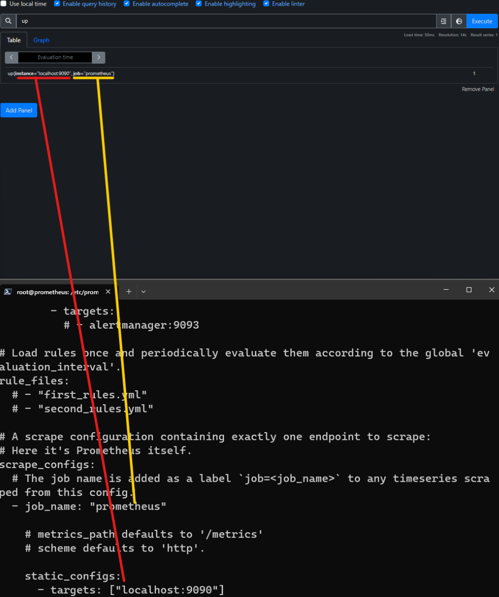

# 🧭 promQL up query

```promql
up
```

<figure><figcaption></figcaption></figure>

`up` fonksiyonu, belirtilen süre içinde scrape edilen hedeflerin durumunu belirtir.  Hedeflerin belirtilen süre içinde scrape edilip edilmediğini, scrape işlemlerinin başarılı olup olmadığını ve hedeflerin mevcut durumunu gösterir.  `up` fonksiyonu, `1` veya `0` değeri ile sonuçlanır. `1`, hedefin scrape edildiği ve metriklerin başarıyla alındığı anlamına gelirken, `0`, hedefin scrape edilemediği veya scrape işleminin başarısız olduğu anlamına gelir.


