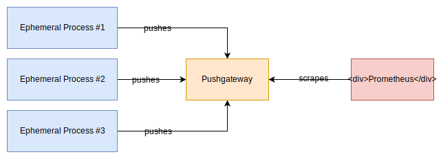

# 📍 Push Gateway

<figure><figcaption></figcaption></figure>

Prometheus, genellikle hedef sistemlerden (uygulamalar, sunucular, ağ cihazları vb.) metrikleri toplamak için kullanılır. Prometheus, HTTP üzerinden hedef sistemlere erişir ve metrikleri düzenli aralıklarla çekerek saklar.

Ancak bazen hedef sistemlerin doğrudan erişilebilir olmadığı durumlar veya geçici olarak erişilemez olduğu anlar olabilir. Bu durumda, Prometheus Push Gateway devreye girer. Push Gateway, hedef sistemlerin metrikleri Prometheus'a itmesine izin verir. Hedef sistemler, Push Gateway'e HTTP POST istekleri göndererek metrikleri Push Gateway'e kaydeder. Ardından Prometheus, Push Gateway'den bu metrikleri alır ve işler.

Push Gateway, Prometheus'un tipik scrape (çekme) modelinden farklı olarak push (itme) modelini kullanır. Bu, hedef sistemlerin metrikleri aktif olarak Prometheus'a gönderdiği anlamına gelir, böylece Prometheus sürekli olarak hedef sistemlere erişmek zorunda kalmaz.

Push Gateway, özellikle geçici, kısa ömürlü veya dinamik hedeflerin olduğu senaryolarda kullanışlıdır. Örneğin, kısa süreli çalışan iş yükleri veya batch işlemleri gibi durumlarda metrikleri toplamak için kullanılabilir.


#### Prometheus Push Gateway'yi Ubuntu 20.04'e kurmak için aşağıdaki adımları takip edebilirsiniz:

1. Gerekli bağımlılıkları yükleyin:

```bash
sudo apt update
sudo apt install -y wget
```

2. Push Gateway'in en son sürümünü [Prometheus GitHub deposundan](https://github.com/prometheus/pushgateway/releases) indirin. Aşağıdaki komutu çalıştırarak en son sürümün indirme bağlantısını alabilirsiniz:

```bash
export PUSHGATEWAY_VERSION="0.10.0"  # Sürüm numarasını güncelleyin
wget https://github.com/prometheus/pushgateway/releases/download/v${PUSHGATEWAY_VERSION}/pushgateway-${PUSHGATEWAY_VERSION}.linux-amd64.tar.gz
```

3. İndirilen arşivi açın:

```bash
tar xvfz pushgateway-${PUSHGATEWAY_VERSION}.linux-amd64.tar.gz
```

4. Push Gateway'in çalıştırılabilir dosyasını `/usr/local/bin/` dizinine kopyalayın:

```bash
sudo cp pushgateway-${PUSHGATEWAY_VERSION}.linux-amd64/pushgateway /usr/local/bin/
```

5. Push Gateway kullanıcısı ve grubunu oluşturun:

```bash
sudo useradd --no-create-home --shell /bin/false pushgateway
```

6. Servis dosyasını oluşturun:

```bash
sudo nano /etc/systemd/system/pushgateway.service
```

Aşağıdaki içeriği yapıştırın ve kaydedin:

```plaintext
[Unit]
Description=Prometheus Push Gateway
Documentation=https://github.com/prometheus/pushgateway
Wants=network-online.target
After=network-online.target

[Service]
User=pushgateway
Group=pushgateway
Type=simple
ExecStart=/usr/local/bin/pushgateway

[Install]
WantedBy=default.target
```

7. Servisi etkinleştirin ve başlatın:

```bash
sudo systemctl daemon-reload
sudo systemctl enable pushgateway
sudo systemctl start pushgateway
```

8. Push Gateway'in doğru şekilde çalıştığını kontrol edin:

```bash
sudo systemctl status pushgateway
```


<figure><figcaption></figcaption></figure>

Artık Prometheus Push Gateway Ubuntu 20.04'te başarıyla kurulmuş ve çalışır durumda olmalıdır. Ayrıca, [http://pushgatewayip:9091/](http://10.90.0.145:9091/) adresinden web arayüzüne erişebiliriz. Push Gateway'e HTTP POST istekleri göndererek metrikleri kaydedebilir ve Prometheus tarafından kullanılabilir hale getirebilirsiniz.


#### Adding Prometheus

```yaml
  - job_name: "push_gateway"
    static_configs:
      - targets: ["10.90.0.145:9091"]
```

Yukarıdaki yapılandırma, Prometheus'un Push Gateway'i hedef almasını sağlayan bir job (iş) tanımıdır. Bu tanım, Prometheus'un Push Gateway üzerinden metrikleri almasını ve saklamasını sağlar.

Aşağıda, verilen örnek yapılandırmanın açıklamasını bulabilirsiniz:

* `job_name: "push_gateway"`: Bu satır, Prometheus için tanımlanan işin adını belirtir. Bu ad, Prometheus yapılandırma dosyasında hedefleyeceğiniz Push Gateway işini belirlemek için kullanılır.
* `static_configs`: Bu bölüm, hedeflerin statik olarak yapılandırılacağını belirtir, yani Push Gateway hedefinin sabit bir IP adresi ve port numarası olduğunu ifade eder.
* `- targets: ["10.90.0.145:9091"]`: Bu satır, Push Gateway hedefini belirtir. Burada "10.90.0.145" IP adresi ve "9091" portu Push Gateway'in konumunu gösterir. Bu, Prometheus'un Push Gateway üzerinden metrikleri çekmek için hedef bir adres olarak kullanacağı anlamına gelir.

Bu tanımı Prometheus yapılandırma dosyanıza eklerseniz, Prometheus Push Gateway'den metrikleri almak için belirlediğiniz adı kullanarak bu işi hedef alacaktır. Prometheus, Push Gateway üzerinden belirtilen IP adresi ve port numarası üzerinden metrikleri toplayacak ve ardından bunları Prometheus veritabanında saklayacaktır.

Bu yapılandırma, Prometheus ve Push Gateway arasındaki entegrasyonu sağlar ve Push Gateway'in metrikleri toplamasını ve Prometheus'a itmesini sağlar. Bu şekilde, Push Gateway'in erişimi güç olan veya geçici olarak erişilemez olan hedef sistemlerden metrikleri alarak, Prometheus'un daha geniş bir metrik yelpazesini toplamasına olanak tanır.

1. Prometheus servisini durdurun:

```bash
sudo systemctl stop prometheus
```

2. Yapılandırma dosyasını düzenleyin:

```bash
sudo nano /etc/prometheus/prometheus.yml
```

3. Dosya içerisinde yeni job tanımını ekleyin. Örneğin:

```yaml
- job_name: "push_gateway"
  static_configs:
    - targets: ["10.90.0.145:9091"]
```

4. Dosyayı kaydedin ve kapatın.
5. Prometheus servisini yeniden başlatın:

```bash
sudo systemctl start prometheus
```

6. Servisin doğru şekilde başladığından emin olmak için durumunu kontrol edin:

```bash
sudo systemctl status prometheus
```

Prometheus servisini yeniden başlattıktan sonra, Prometheus Push Gateway'i hedef alan job tanımı etkinleştirilecek ve Prometheus, Push Gateway üzerinden metrikleri almaya başlayacaktır. Push Gateway'den gelen metrikler, Prometheus veritabanında depolanacak ve kullanılabilir hale gelecektir.

Not: Yapılandırma dosyasını değiştirdikten sonra herhangi bir hata mesajı alırsanız veya servis başarılı bir şekilde başlamazsa, yapılandırma dosyasını doğru şekilde düzenlediğinizden ve sözdizimine dikkat ettiğinizden emin olun. Hataları tespit etmek için servis günlüklerini kontrol etmeyi unutmayın (`sudo journalctl -u prometheus`).

<figure><figcaption><p>Göreceğiniz üzere push_gateway hedefi up durumdadır.</p></figcaption></figure>

#### Push Gateway'e bir POST isteği göndermek için kullanılan tam URL'nin formatı şu şekildedir:


```
POST http://<push_gateway_host>:9091/metrics/job/<job_name>/instance/<instance_name> HTTP/1.1
```


Burada `<push_gateway_host>`, Push Gateway'in IP adresini veya alan adını temsil eder. Push Gateway'in IP adresi veya alan adı, isteği göndermek istediğiniz hedef Push Gateway'e karşılık gelir. Port numarası `9091` olarak belirtilir, çünkü Push Gateway genellikle bu port üzerinde çalışır.

`<job_name>`, Push Gateway'e gönderilen metriğin ait olduğu işin adını temsil eder. Örneğin, bu bir uygulamanın veya hizmetin adı olabilir.

`<instance_name>`, metriğin ait olduğu işin belirli bir örneğini temsil eder. Bu, aynı işten birden fazla örneğiniz olduğunda farklı örneklerin metriklerini ayırmak için kullanılabilir.

Örneğin, aşağıdaki URL'ü ele alalım:

```
POST http://10.90.0.145:9091/metrics/job/myjob/instance/myinstance HTTP/1.1
```

Bu örnekte, `10.90.0.145` IP adresiyle erişilebilen Push Gateway'e bir POST isteği gönderiliyor. İsteğin hedefi, `myjob` adlı bir iş ve `myinstance` adlı bir sunucu/cihaz üzerindeki metriklerdir.

Gerçek senaryolar için, `<push_gateway_host>` kısmını kendi Push Gateway IP adresiniz veya alan adınızla değiştirmeniz gerekmektedir. Ayrıca, `<job_name>` ve `<instance_name>` kısımlarını kendi metrikleriniz ve iş/cihaz adlarınıza göre değiştirmeniz gerekecektir.

Bu tam URL formatını kullanarak Push Gateway'e POST isteği göndererek, belirlediğiniz iş ve örneğe ait metrikleri kaydedebilirsiniz.


Push Gateway'e metrikleri göndermek için Prometheus'un özel bir metrik formatını kullanmanız gerekmektedir. Push Gateway, metrikleri Prometheus'un anlayabileceği metrik formatına çevirir ve kaydeder.

Aşağıdaki gibi doğru bir örnek ile Push Gateway'e metrik göndermeyi deneyebilirsiniz:

```bash
echo 'my_metric{label1="value1", label2="value2"} 42.5' | curl -X POST --data-binary @- http://10.90.0.145:9091/metrics/job/myjob/instance/myinstance
```

Bu komut, metriği doğrudan Push Gateway'e gönderir. `echo` komutuyla metriği oluşturur ve ardından `curl` ile POST isteğini gerçekleştirir. Push Gateway, metriği alır, Prometheus için uygun formata çevirir ve kaydeder.

Yine, `<push_gateway_host>` kısmını kendi Push Gateway IP adresiniz veya alan adınızla, `<job_name>` ve `<instance_name>` kısımlarını da kendi metrikleriniz ve iş/cihaz adlarınıza göre değiştirmeniz gerekmektedir.

Bu şekilde Push Gateway'e metrik göndermeyi deneyebilirsiniz.

<figure><figcaption><p>Göreceğiniz üzere, metrik push gateway üzerinde gözükmektedir.</p></figcaption></figure>

<figure><figcaption><p>Prometheus web arayüzünden kontrol ettiğimizde gönderdiğimiz metriğe ait verilere ulaşabildiğimizi görüyoruz.</p></figcaption></figure>

Push Gateway metrikleri alırken, etiketlerde değişiklik yapabilir, yeni etiketler ekleyebilir.  Ancak, bazı durumlarda orijinal metrik etiketlerini korumak önemli olabilir. Bu durumda, `honor_labels` özelliği kullanılarak Push Gateway'in orijinal etiketleri koruması sağlanır.

```yaml
- job_name: "push_gateway"
    honor_labels: true
    static_configs:
      - targets: ["10.90.0.145:9091"]
```

`honor_labels` özelliği, Push Gateway yapılandırma dosyasında yukarıdaki şekilde kullanılabilir:

<figure><figcaption><p>Mavi le işaretlediğim satırda göreceğiniz üzere prometheus'un kendi eklemiş olduğu gereksiz etiketler kaldırıldı.</p></figcaption></figure>

#### With cronjob:

```bash
#!/bin/bash
echo "my_date{source=\"system\"} $(date +%s)" | curl --data-binary @- http://10.90.0.145:9091/metrics/job/cronjob/instance/myscript
```

Yukarıdaki script ile tarih bilgisini saniye cinsinden, push gateway'e gönderiyoruz. Bunu sürekli göndermek için crontab'a bu scripti eklemeliyiz.

```bash
* * * * * /root/date_clock.sh
```

Ardından prometheus web arayüzünden veya push gateway'den gelen veriyi kontrol edebiliriz.

<figure><figcaption></figcaption></figure>

Göreceğiniz üzere "my\_date" metriğine ait veriler prometheus uygulamamıza ulaşmaya başladı.


With Python;


```python
from prometheus_client import CollectorRegistry, Gauge, push_to_gateway

registry = CollectorRegistry()
g = Gauge('job_last_success_unixtime', 'Last time a batch job successfully finished', registry=registry)
g.set_to_current_time()
push_to_gateway('10.90.0.145:9091', job='batchA', registry=registry)
```

Jobu çalıştırdıktan sonra, prometheus arayüzünden gelen veriyi kontrol edebiliriz;

<figure><figcaption></figcaption></figure>


<mark style="color:purple;">Yukarıdaki Python kodu, bir işin son başarılı şekilde tamamlandığı zamanı ölçen ve bunu Pushgateway aracına gönderen bir kod parçasıdır.</mark>

<mark style="color:purple;">Kodun yaptığı işlemleri şöyle açıklayabilirim:</mark>

* <mark style="color:purple;">from prometheus\_client import CollectorRegistry, Gauge, push\_to\_gateway</mark>

<mark style="color:purple;">Bu satırda, prometheus\_client adlı bir kütüphaneden CollectorRegistry, Gauge ve push\_to\_gateway adlı üç fonksiyonu içe aktarıyoruz. Bu fonksiyonlar, Prometheus ile etkileşim kurmak için gerekli olan metrik tanımlama, kaydetme ve gönderme işlevlerini sağlar.</mark>

* <mark style="color:purple;">registry = CollectorRegistry()</mark>

<mark style="color:purple;">Bu satırda, CollectorRegistry fonksiyonunu çağırarak registry adlı bir değişken oluşturuyoruz. Bu değişken, bir CollectorRegistry nesnesi tutar. Bu nesne ise, Prometheus'un metriklerini kaydetmek için kullanılan bir kayıt defteridir.</mark>

* <mark style="color:purple;">g = Gauge('job\_last\_success\_unixtime', 'Last time a batch job successfully finished', registry=registry)</mark>

<mark style="color:purple;">Bu satırda, Gauge fonksiyonunu çağırarak g adlı bir değişken oluşturuyoruz. Bu değişken, bir Gauge nesnesi tutar. Bu nesne ise, Prometheus'un anlık olarak ölçebileceği bir metrik türüdür. Bu metrik türü, tek bir değer alabilir ve bu değer zamanla artabilir veya azalabilir. Gauge fonksiyonuna üç parametre veriyoruz: metriğin adı, metriğin açıklaması ve metriğin kaydedileceği kayıt defteri.</mark>

* <mark style="color:purple;">g.set\_to\_current\_time()</mark>

<mark style="color:purple;">Bu satırda, g değişkeninin set\_to\_current\_time adlı bir metodunu çağırıyoruz. Bu metod ise, g değişkeninin değerini mevcut zamanın saniye cinsinden değerine ayarlar. Böylece, işin son başarılı şekilde tamamlandığı zamanı ölçmüş oluyoruz.</mark>

* <mark style="color:purple;">push\_to\_gateway('10.90.0.145:9091', job='batchA', registry=registry)</mark>

<mark style="color:purple;">Bu satırda, push\_to\_gateway fonksiyonunu çağırıyoruz. Bu fonksiyon ise, kayıt defterindeki metrikleri Pushgateway'e gönderir. Pushgateway'e üç parametre veriyoruz: Pushgateway'in çalıştığı IP adresi ve port numarası, işin adı ve kayıt defteri.</mark>


Pushgateway, normalde prometheus tarafından izlenemeyen işlerden veri toplamak için kullanılan bir araçtır. Ancak Pushgateway’in kullanımı bazı durumlarda sakıncalı olabilir. Pushgateway pitfalls’lerden bazıları şunlardır:

* Birden fazla işten veri toplamak için tek bir Pushgateway kullanılırsa, Pushgateway hem tek başarısızlık noktası hem de potansiyel bir darboğaz haline gelir.
* Prometheus’un her izleme işleminde ürettiği up metriğini kaybedersiniz. Bu metrik, işlerin sağlıklı olup olmadığını gösterir.
* Pushgateway, kendisine gönderilen verileri asla unutmaz ve bunları Prometheus’a sürekli olarak sunar. Bu veriler manuel olarak Pushgateway’in API’si aracılığıyla silinmediği sürece Prometheus’ta kalır.

Bu nedenle, Pushgateway’i genel veri toplama amacıyla kullanmak yerine, sadece servis seviyesindeki toplu işlerin sonucunu yakalamak için kullanmak daha uygundur. Servis seviyesindeki toplu işler, belirli bir makine veya iş örneğiyle ilişkili olmayan işlerdir (örneğin, bir servis için birkaç kullanıcıyı silen bir toplu iş).&#x20;

