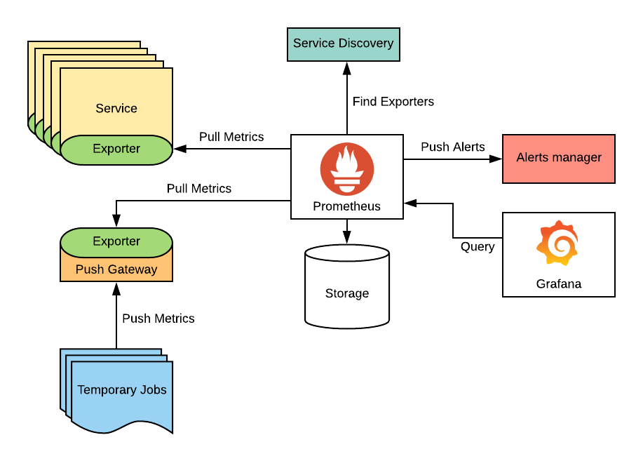

# 📈 Terminoloji

<figure><figcaption></figcaption></figure>

#### Nedir?

* Prometheus, aktif bir ekosistemi olan açık kaynaklı bir sistem izleme ve uyarı aracıdır.
* Bu araç, keşfedilen metriklerden uygulamalarınızın ve altyapınızın nasıl performans gösterdiğini analiz etmenizi sağlar.
* Prometheus bileşenleri Go dilinde yazılmıştır.
* 'multi-dimensional' bir veri modeli kullanır ve 'zaman serisi verileri' 'metrik adı' ve 'anahtar/değer çiftleri' ile tanımlanır.

```promql
http_requests_total {method="get"}
 (metric name )     (key) (value)
```

#### Kullanıma hazır bazı özellikler,

* Çok basit bir sorgu dili olan 'PromQL' kullanır. PromQL, saklanan zaman serilerindeki herhangi bir etikette birleştirme yapmanıza izin veren 'read only' ve esnek bir sorgu dili olarak hizmet verir.
* Prometheus için varsayılan kitaplıklar ve sunucular mevcuttur - Windows, Linux makineleri, Mysql vb.
* Özel servisleri izlemek için Go, Java veya Scale, Python, Ruby ve daha birçok Prometheus istemci kitaplığı aracılığıyla kodunuza araçlar ekleyebilirsiniz.
* Prometheus Kendi Alert manager' ına sahiptir.

### Terminoloji

#### Monitoring;&#x20;

Bir hedef proje, program veya hizmette yer alan faaliyetlerin toplanması ve kaydedilmesi ve ardından bu kaydedilen değerlerin hedeflerin amaçlarına ulaşıp ulaşmadığını kontrol etmek için kullanıldığı sistematik bir süreçtir.

#### Alert/Alerting;

Aktif olarak tetiklenen prometheus'taki bir uyarı kuralının sonucudur. Uyarılar Prometheus'tan AlertManager'a gönderilir.

#### AlertManager;

Alertmanager, Prometheus tarafından toplanan ölçümleri izleyerek belirli bir eşik değerini aşan ölçümlere dayanarak uyarılar oluşturur. Alertmanager, Prometheus'a benzer şekilde yapılandırılır ve Prometheus'tan gelen uyarıları işler. Alertmanager, uyarıları gruplandırabilir, filtreleyebilir. Ayrıca uyarıları farklı kanallara yönlendirebilir, örneğin e-posta, SMS, Slack veya PagerDuty gibi çeşitli kanallara.&#x20;

#### Target;

Prometheus tarafından toplanan metriklerin kaynağına karşılık gelir. Bir target, genellikle bir sistem, bir uygulama, bir veritabanı veya bir servis olabilir. Prometheus, her bir target için belirli bir URL veya endpoint belirleyerek, o target'tan metrikleri toplar. Target'ların belirlenmesi, Prometheus'un ölçümleri toplamaya başlayacağı kaynakları tanımlamasını sağlar.

#### Instance;

Genellikle bir sistem, bir uygulama, bir veritabanı veya bir servisin belirli bir örneğini ifade eder. Prometheus'ta "instance" kavramı da bu anlamda kullanılır.


"Instance", bir target'ın belirli bir örneğini ifade ederken, "target" kavramı ise Prometheus tarafından toplanan metriklerin kaynağını ifade eder. Örneğin, bir target olarak belirlenmiş bir web sunucusunun, birden fazla sunucuda çalışan birkaç örneği olabilir. Her bir örnek, aynı target'tan farklı ölçümler içerecektir ve Prometheus her bir instance için ayrı ayrı metrikler toplayacaktır. Bu nedenle, target, kaynağın tamamını ifade ederken, instance, belirli bir örneğini ifade eder. Target, birden fazla instance'a sahip olabilir ve Prometheus, her bir instance için ayrı ayrı metrikler toplar.


#### Job;

Belirli bir işlevi veya görevi olan bir veri toplama işlemi için kullanılır. Bir job, Prometheus tarafından izlenen birden fazla instance'ı içerebilir. Örneğin, bir web sunucusunu izlemek için bir job oluşturulabilir. Bu job, birden fazla web sunucusunun her bir instance'ını izleyebilir ve topladığı metrikleri işleyerek, bu sunucuların performansını ve durumunu ölçebilir. Bir job, birden fazla instance'ı içerebilir ve Prometheus, her bir instance için ayrı ayrı metrikler toplar.


Prometheus, bir job için belirli bir scrape interval (örneğin, 15 saniye) ayarlayarak, bu job'un belirli aralıklarla metrikleri toplamasını sağlar. Her scrape işlemi sırasında, job, tüm instance'larınızdan metrikler toplar ve bu metrikleri bir araya getirerek, bir sonraki scrape işlemi sırasında kullanılmak üzere bir zaman serisi veri kaydeder.


Örnek;

```yaml
- job_name: web-server
  static_configs:
    - targets: ['192.168.1.100:8080', '192.168.1.101:8080']
  metrics_path: /metrics
  scheme: http
  scrape_interval: 15s
```

#### Sample;

Prometheus, veri toplamak için scrape işlemleri yapar ve bu scrape işlemleri sırasında, ölçümlerden elde edilen değerler, "sample" olarak adlandırılır.

\


\
