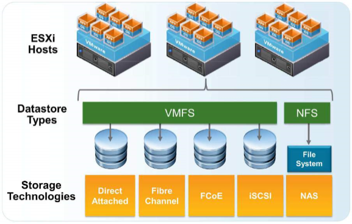

# Vmware Storage Technologies

<figure><figcaption></figcaption></figure>

Sanal ağ tarafını uçtan uca tamamladıktan sonra, vSphere mimarisinin ikinci temel ayağına geçiyoruz: **depolama**. Sanal makinelerin diskleri, snapshot'ları, konfigürasyon dosyaları ve şablonları depolama katmanında yaşar; vMotion, HA ve DRS gibi kritik özelliklerin çalışabilmesi de doğrudan bu katmanın nasıl tasarlandığına bağlıdır.

Bu makalede vSphere'in desteklediği depolama teknolojilerini, iki temel datastore tipini ve hangi teknolojinin hangi vSphere özelliğini desteklediğini ele alacağız. Amaç, ilerideki yapılandırma adımlarına geçmeden önce "hangi senaryoda ne kullanılır" sorusunun sağlam bir cevabını oluşturmak.

### İki Temel Kavram: Datastore Tipi ve Depolama Teknolojisi

Konuya girerken sık karıştırılan iki kavramı ayırmak gerekir:

* **Datastore tipi**, ESXi'nin diski nasıl biçimlendirdiği ve yönettiğidir: **VMFS** veya **NFS**.
* **Depolama teknolojisi**, o diske fiziksel olarak nasıl ulaşıldığıdır: local disk, Fibre Channel, FCoE, iSCSI veya NAS.

İlişki şöyle kurulur: **blok tabanlı** teknolojiler (DAS, FC, FCoE, iSCSI) ESXi'ye ham bir LUN sunar ve ESXi bu LUN'u kendi dosya sistemi olan **VMFS** ile biçimlendirir. **Dosya tabanlı** teknoloji olan NAS ise zaten biçimlendirilmiş bir paylaşım sunar; ESXi bunu **NFS datastore** olarak bağlar ve üzerinde ayrıca bir dosya sistemi oluşturmaz.

#### VMFS

VMware'in kümelenebilir (clustered) dosya sistemidir ve vSphere ortamlarında en yaygın kullanılan datastore tipidir. Temel özelliği, **birden fazla ESXi host'un aynı anda aynı volume'a güvenle yazabilmesidir** — vMotion, HA ve DRS'in temelinde bu yetenek yatar.

Sürümler arasında önemli farklar vardır:

* **VMFS-3:** Eski nesil; 2 TB'lık dosya boyutu sınırı ve blok boyutu bağımlılığı gibi kısıtları vardır.
* **VMFS-5:** 64 TB'a kadar volume, sabit 1 MB blok boyutu ve 62 TB'a kadar sanal disk desteği.
* **VMFS-6:** Modern sürüm; otomatik UNMAP (silinen alanın storage'a geri bildirilmesi), 4K native disk desteği ve iyileştirilmiş kaynak yönetimi sunar.

Not: VMFS-5'ten VMFS-6'ya doğrudan yerinde yükseltme yapılamaz; yeni datastore oluşturup Storage vMotion ile taşınması gerekir. Yeni kurulumlarda tercih daima en güncel sürümden yana olmalıdır.

#### NFS

Ağ üzerinden erişilen dosya sistemidir. ESXi burada dosya sistemini kendisi oluşturmaz; NAS cihazının sunduğu paylaşımı doğrudan datastore olarak bağlar.

* **NFS v3:** Uzun yıllar standart olan sürüm; tek yol (single path) üzerinden çalışır.
* **NFS v4.1:** Çoklu yol (multipathing) ve Kerberos kimlik doğrulama desteği getirir; ancak bazı vSphere özellikleriyle uyumluluk farkları vardır.

### Depolama Teknolojileri

#### DAS (Direct Attached Storage) — Local Disk

Host'un içindeki fiziksel disklerdir. Sunucuda iki, üç veya daha fazla disk bulunabilir; bunlar bir RAID denetleyicisi üzerinden birleştirildiğinde ESXi tek bir büyük disk görür. RAID kullanılmıyorsa her disk ayrı ayrı listelenir.

* **Avantajları:** Ek altyapı gerektirmez, düşük gecikme sunar, maliyeti düşüktür.
* **Temel sınırı:** **Paylaşımlı değildir.** Yalnızca o host erişebilir — ve bu, vSphere'in cluster özelliklerini kullanmanın önündeki en büyük engeldir.

Tipik kullanım: ESXi kurulumu, scratch/log alanı, izole test iş yükleri ve vSAN'ın yapı taşı olarak (aşağıda değinilecek).

#### Fibre Channel (FC)

Kendine ait bir ağ altyapısı (FC HBA kartları, FC switch'ler, fiber kablolar) üzerinden çalışan blok tabanlı depolama teknolojisidir.

* **Avantajları:** Düşük ve öngörülebilir gecikme, yüksek verim, Ethernet trafiğinden tamamen izole bir yol.
* **Dezavantajları:** Yüksek maliyet (özel donanım ve ayrı switch altyapısı) ve ayrı bir uzmanlık gerektiren yönetim (zoning, WWN yönetimi).

Kritik veritabanları ve gecikmeye duyarlı iş yüklerinin bulunduğu kurumsal ortamlarda tercih edilir.

#### FCoE (Fibre Channel over Ethernet)

FC protokolünü Ethernet üzerinde taşır; böylece ayrı bir FC altyapısı kurmadan FC'ye benzer davranış elde edilir. Ancak kayıpsız Ethernet (DCB/PFC) desteği gerektirdiği için fiziksel ağ tarafında özel yapılandırma ister. Pazar payı zamanla azalmış, birçok ortam doğrudan iSCSI veya NVMe-oF'a yönelmiştir.

#### iSCSI

SCSI komutlarını standart TCP/IP ağı üzerinden taşır. Bugün en yaygın kullanılan paylaşımlı depolama teknolojilerinden biridir.

* **Avantajları:** Mevcut Ethernet altyapısını kullanır, maliyeti FC'ye göre belirgin şekilde düşüktür, yönetimi tanıdıktır.
* **Dezavantajları:** Ağ trafiğini paylaşır; doğru izole edilmezse performans dalgalanmaları yaşanır.

Modern 10/25GbE ağlar ve SSD tabanlı storage array'ler ile iSCSI, çoğu iş yükü için fazlasıyla yeterli performans sunar — FC kadar düşük gecikmeli olmasa da fiyat/performans dengesi çoğu ortamda onu öne çıkarır.

**iSCSI için temel en iyi pratikler:**

* Storage trafiğini **ayrı bir VLAN'da** izole edin; VM ve management trafiğiyle aynı broadcast domain'de tutmayın.
* Her host'ta **birden fazla VMkernel portu** ile **iSCSI port binding** yapılandırarak çoklu yol (multipathing) sağlayın.
* Path selection policy olarak, array'iniz destekliyorsa **Round Robin** kullanın.
* **Jumbo Frames (MTU 9000)** verim kazandırır, ancak uçtan uca — vmk, vSwitch, fiziksel switch ve array — tutarlı olmak zorundadır.
* Ağ tarafında redundancy'yi ihmal etmeyin: storage yolunun kesilmesi, VM'lerin diskini kaybetmesi demektir.

#### NAS (NFS ile erişilen paylaşım)

Diğerlerinden yapısal olarak farklıdır: ESXi'ye ham bir disk değil, **hazır bir dizin paylaşımı** sunulur. Bir depolama cihazı üzerinde oluşturulan klasör NFS ile paylaşılır, host bu paylaşımı datastore olarak bağlar.

* **Avantajları:** Kurulumu ve yönetimi basittir, kapasite genişletmesi kolaydır, VMFS biçimlendirme adımı yoktur. Thin provisioning davranışı doğaldır.
* **Dezavantajları:** Blok tabanlı çözümlere göre bazı senaryolarda performans farkı olabilir; RDM gibi blok seviyesi özellikler kullanılamaz.

#### vSAN

Ayrı bir kategori olarak anmak gerekir: vSAN, host'ların **yerel disklerini** (DAS) yazılım katmanında birleştirerek cluster genelinde paylaşımlı bir datastore oluşturur. Böylece DAS'ın en büyük dezavantajı olan "paylaşılamama" sorunu ortadan kalkar ve ayrı bir storage array'e ihtiyaç duymadan HA, DRS ve vMotion kullanılabilir hale gelir. Hiperkonverjan (HCI) mimarilerin vSphere'deki karşılığıdır.

### Hangi Teknoloji Hangi Özelliği Destekler?

Depolama seçiminin en kritik boyutu budur: seçtiğiniz teknoloji, kullanabileceğiniz vSphere özelliklerini doğrudan belirler.

| Teknoloji         | Boot from SAN | vMotion   | HA / DRS | Fault Tolerance | RDM   |
| ----------------- | ------------- | --------- | -------- | --------------- | ----- |
| **Fibre Channel** | Evet          | Evet      | Evet     | Evet            | Evet  |
| **FCoE**          | Evet          | Evet      | Evet     | Evet            | Evet  |
| **iSCSI**         | Evet          | Evet      | Evet     | Evet            | Evet  |
| **NFS / NAS**     | Hayır         | Evet      | Evet     | Evet            | Hayır |
| **DAS (local)**   | —             | Sınırlı\* | Hayır    | Hayır           | Hayır |
| **vSAN**          | Hayır         | Evet      | Evet     | Evet            | Hayır |

Tablonun okunması gereken üç satırı vardır:

**NFS'te Boot from SAN yoktur.** Bunun nedeni yapısaldır: NFS bir disk değil, bir dizin paylaşımıdır; host bir klasörden boot edemez. Aynı nedenle **RDM (Raw Device Mapping)** de NFS üzerinde kullanılamaz — RDM, VM'e ham bir LUN sunma tekniğidir ve dosya tabanlı bir paylaşımda karşılığı yoktur.

**DAS, cluster özelliklerini desteklemez.** Yerel disk yalnızca tek host tarafından görüldüğü için HA ve DRS çalışamaz: bir host çöktüğünde diğer host'lar o VM'in disklerine erişemez. vMotion tarafındaki durum ise koşulludur — klasik vMotion paylaşımlı storage gerektirir; local disk üzerindeki bir VM'i başka host'a taşımak ancak **Storage vMotion ile birlikte** (X-vMotion / shared-nothing vMotion) mümkündür ve bu işlem diskin ağ üzerinden fiilen kopyalanması anlamına gelir. Yani teknik olarak taşınabilir, ancak cluster dayanıklılığı sağlanamaz.

**Paylaşımlı storage, HA ve DRS'in ön koşuludur.** Bir cluster kurup HA'dan yararlanmak istiyorsanız, tüm host'ların erişebildiği bir datastore zorunludur — bu ister FC, ister iSCSI, ister NFS, ister vSAN olsun.

### Doğru Teknolojiyi Seçmek

Pratikte karar birkaç faktörün kesişiminde verilir:

* **Bütçe ve mevcut altyapı:** Ethernet altyapınız varsa iSCSI en hızlı yoldur. FC, mevcut bir FC ağı yoksa yüksek bir giriş maliyeti demektir.
* **Performans gereksinimi:** Gecikmeye duyarlı veritabanları FC veya NVMe-oF tarafına yönlendirir; genel amaçlı sunucu iş yükleri için iSCSI/NFS fazlasıyla yeterlidir.
* **Ekip yetkinliği:** FC zoning ve WWN yönetimi ayrı bir uzmanlıktır; iSCSI ve NFS, ağ ekibinin zaten bildiği araçlarla yönetilir.
* **Ölçek ve büyüme modeli:** Node ekleyerek büyüyen bir model hedefliyorsanız vSAN/HCI değerlendirilmelidir.
* **Özellik ihtiyacı:** RDM veya boot from SAN gerekiyorsa NFS eleme dışı kalır.

Yaygın ve sağlıklı bir yaklaşım, tek bir teknolojiye bağlanmak yerine **katmanlı tasarımdır**: ESXi kurulumu ve log alanı için local disk, genel VM iş yükleri için iSCSI veya NFS, gecikmeye duyarlı kritik iş yükleri için FC. Hangi kombinasyonu seçerseniz seçin, uçtan uca yol yedekliliği (çoklu HBA/NIC, çoklu switch, çoklu controller) pazarlık konusu olmamalıdır — depolama yolunun kesilmesi, ağ kesintisinden çok daha ağır sonuçlar doğurur.

### Sonuç

vSphere depolama mimarisi iki soruya verilen cevapla şekillenir: **hangi datastore tipi** ve **hangi erişim teknolojisi**. Özetle:

* **VMFS** blok tabanlı teknolojiler (DAS, FC, FCoE, iSCSI) üzerinde çalışan, çoklu host erişimine izin veren kümelenebilir dosya sistemidir; **NFS** ise ağ üzerinden bağlanan hazır bir dosya paylaşımıdır.
* **FC** en yüksek performansı en yüksek maliyetle, **iSCSI** en dengeli fiyat/performans oranını, **NFS** en basit yönetimi, **DAS** ise paylaşımsız yerel kapasiteyi sunar; **vSAN**, DAS'ı cluster genelinde paylaşımlı hale getirerek arada bir köprü kurar.
* Teknoloji seçimi doğrudan özellik setini belirler: **NFS'te boot from SAN ve RDM yoktur; DAS ile HA ve DRS kullanılamaz.**
* Paylaşımlı depolama, cluster özelliklerinin ön koşuludur — HA, DRS ve klasik vMotion bu temele dayanır.

Serinin devamında bu teknolojileri uygulamaya dökeceğiz: VMFS datastore oluşturma, iSCSI hedeflerinin ESXi'ye tanıtılması ve çoklu yol yapılandırması, NFS paylaşımlarının bağlanması ve datastore yönetiminin günlük operasyonel pratikleri.
